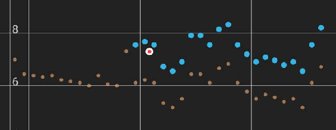

This menu provides some important settings and mechanisms for calibration.

!!!xdrip ""   
    &ensp;Settings  
    &emsp;Less Common Settings  
    &emsp;&ensp;Advanced Calibration

##### Use Treatment BG values

You can decide to use BG [treatments](../../use/mainUI/#treatments) (blood tests) as calibrations.

!!!xdripitem "Use Treatment BG values"  
    &ensp;Choose whether to calibrate with the BG value in a Treatments entry  

!!!warning  
    Always use treatments as calibrations is **not recommended**.

Automatic mode will only suggest you to use the treatment as a calibration if xDrip+ detects that current conditions are good to calibrate (like BG stable for 20 minutes, low noise).

!!!xdripitem "Use Treatment BG values"  
    &emsp;Automatic mode (best)&emsp;○  
    &emsp;Ask me every time&emsp;&emsp;&emsp;○  
    &emsp;Never use them&nbsp;&emsp;&emsp;&emsp;&emsp;●  
    &emsp;Always use them&nbsp;&ensp;&emsp;&emsp;&emsp;○ 

It might also suggest to you enable automatic calibration.  

**It is not recommended to use this feature with G6/G7/1/1+ sensors.**

!!!xdripitem "Enable automatic calibration"  
    &emsp;Entered blood tests which occur during flat trend periods can automatically be used to recalibrate after 20 minutes. This should provide the most accurate method to calibrate with.  
    

    &ensp;Do you want to enable this feature?  
    
    &emsp;&ensp;NO&ensp;&emsp;&emsp;&emsp;&emsp;YES, ENABLE

Ask me every time will do exactly this every time you enter a BG treatment.

!!!xdripitem "Use BG for calibration?"  
    &emsp;Do you want to use this entered finger-stick blood glucose test to calibrate with?  

Never use treatments will never use them to calibrate (and will prevent you from transforming a [treatment](../../use/mainUI/#treatments) into a calibration).

##### Automatic Calibration

It is recommended to **disable this for G6/G7/1/1+ sensors**.

Automatic calibration will accept a treatment as a calibration if it satisfies the conditions of a flat trend for 20 minutes.

!!!xdripitem "Automatic Calibrations "  
    &ensp;Calibrate using new blood glucose reading if the conditions appear right to do so without asking confirmation (experimental)  

### Plugins

Calibration plugins are available in xDrip+, most are not used anymore.  If enabled, a plugin acts instead of the standard xDrip+ calibration. The idea was to have a customizable calibration algorithm selection but was never fully implemented. In general, a sensor needing a plugin to be calibrated should be replaced for safety reasons.

!!!warning "**SAFETY**"  
    **Calibration safety mechanisms do not apply to plugins. Using a plugin to bypass calibration failure is dangerous.**

!!!xdripitem "Calibration Plugin"  
    &ensp;Experimental calibration secondary plugin  

!!!warning "Wear extension"  
    Plugins are not fully implemented in Wear. You might see different values on your watch.

!!!xdripitem "Calibration Plugin"  
    &emsp;None  
    &emsp;Datricsae  
    &emsp;Fixed slope - **DO NOT USE**  
    &emsp;xDrip   
    &emsp;Last7Ua

**`None`** by default the xDrip+ algorithm is used. **Recommended**

**`Datricsae`** was popular with those in trouble with default xDrip+ algorithm. It requires 8 calibration points (if less than 4 the original xDrip+ algorithm will be used) and has slope limits between 0.5 and 1.7. Its main strength is to remove outliers (bad calibration points) that fall too far out of the calibration line. Once filtered, if the number of calibration points fall below 4 or slope is out of limits, the classic xDrip+ algorithm is used.  
Be careful as noisy calibrations might lead to inconsistent results.

**`Fixed slope`** is an empty plugin returning slope 1.08 and intercept -5. **Do not use it for real BG.**

**`xDrip Original`** was the plugin equivalent of the xDrip+ algorithm. It doesn't do anything else than the xDrip+ algorithm. **There is no added value in using it.**

**`Last 7 unweighted`** was an early attempt to improve the original algorithm. It requires at least 7 calibrations (if non-existing, current xDrip+ algorithm is used). **Not recommended.**

!!!xdripitem "Plugin plot on graph "  
    &ensp;Show glucose results from the plugin on the main graph  

Enable if you want xDrip+ to plot results using the plugin.

!!!xdripitem "Use Plugin Glucose "  
    &ensp;Main glucose display number comes from plugin!  

Enable if you want the main BG number to be from plugin results. A circled P will show.

!!!xdripitem "Plugin Override ALL "  
    &ensp;Main glucose display number comes from plugin!  

Not implemented.

### Calibrations

!!!xdripitem "Double Calibrations "  
    &ensp;Ask for a second optional initial calibration blood test  

If you're not actually performing two different blood tests for initial calibration: disable this.

!!!xdripitem "Infrequent Calibration "  
    &ensp;If needed, use calibrations from longer ago, e.g. if calibrations are supplies infrequently  

Calibrations get ignored when too old, if you calibrate rarely and want older calibrations measurements to weight on the current calibration curve: enable this. 

### Libre specific

##### Non-fixed Libre Slopes

!!!xdripitem "Non-fixed Libre Slopes "  
    &ensp;Enable to allow variable slopes with Libre collection methods  

Libre sensors might be difficult to calibrate. If you cannot manage to get full range accuracy or never calibrate in the higher range, disable this and make the slope equal to 1. This is recommended for beginners.

**Always calibrate at stable glucose when in the lower normal range for safety.**

!!!xdripitem "Check Libre Serial "  
    &ensp;Automatically stop if Libre Serial changes unexpectedly  

Carrying forward calibrations from the old sensor to a new one is dangerous. **Leave this enabled.**

### Bypass quality check

!!!xdripitem "Bypass quality check "  
    &ensp;Allow initial calibration even if we don't have good enough data. Beware could result in inaccurate calibration.  

During preliminary measurements for first calibration, 3 valid measurements are required. If they are missing or fail safety values, xDrip+ will wait. Enabling this will allow calibration without checking. **Not recommended.**

!!!xdripitem "Collecting Initial Readings"  
    &ensp;✔ Data collector running  
    &ensp;✔ Receiving data from collector  
    &ensp;✔ Received some recent data  
    &ensp;⧖ Received enough good data to calibrate  
    &ensp;**Need 3 recent readings, got only one so far**  
    &ensp;Next reading expected in 1 minute 

 

[*Last modified 7/12/2024*](https://github.com/NightscoutFoundation/xDrip/releases/tag/2024.11.26)
