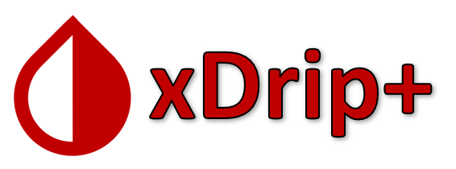
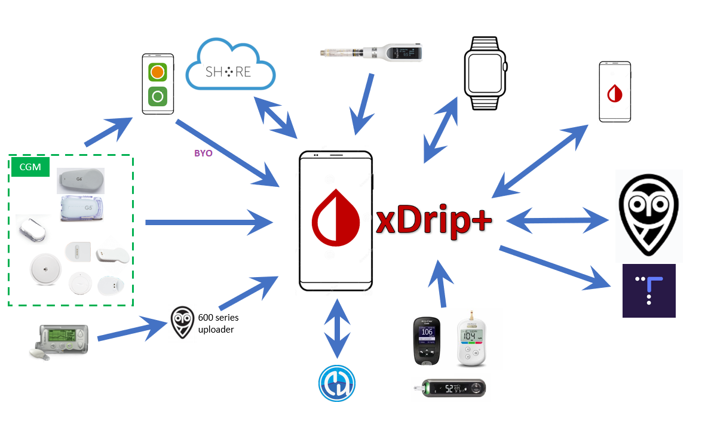

 

## What is xDrip+?

xDrip+ is an unofficial and independent Android app which works as data hub and processor between many different devices.

It supports wireless connections to G4, G5, G6, Medtrum A6, Libre via NFC and Bluetooth, 630G, 640G, 670G pumps and Eversense CGM via companion apps. Bluetooth Glucose Meters such as the Contour Next One, AccuChek Guide, Verio Flex & Diamond Mini as well as devices like the Pendiq 2.0 Insulin Pen.

Heart-rate and step counter data is processed from Android Wear, Garmin, Fitbit and Pebble smart-watches and watch-faces for those that show glucose values and graphs.

On some Android Wear watches, it is possible for the G5 or G6 to talk directly to the watch so it can display values even when out of range of the phone.

The app contains sophisticated charting, customization and data entry features as well as a predictive simulation model.

Instant two-way synchronization is possible by linking follower handsets, data can also be uploaded and downloaded to a Nightscout web service or uploaded directly to Tidepool, MongoDB or InfluxDB.

Customization allows for different options to configure alarms, vocalize readings, change the display preferences etc. International users can update translations from within the app too.

Your data is yours and can be exported in many different ways. xDrip also intercommunicates with other apps, for example sending and receiving live data with AndroidAPS.

## History

[DexDrip](https://github.com/StephenBlackWasAlreadyTaken/DexDrip)  was created by Emma Black in 2014 and then became [xDrip](http://stephenblackwasalreadytaken.github.io/xDrip/), an app collecting CGM data from a G4 receiver or a bridge device and sending them to [Nightscout](https://nightscout.github.io/).  It also came with the follower app [Nightwatch](http://stephenblackwasalreadytaken.github.io/NightWatch/) (obsolete).

This project was then modified by @jamorham to become [xDrip+](https://jamorham.github.io/#xdrip-plus).

> *Personal research version of xDrip*

xDrip+ is published by the Nightscout Foundation.

## **Disclaimer And Warning**

- All information, thought, and code described here is intended for informational and educational purposes only. Use xDrip+ at your own risk, and do not use the information or code to make medical decisions.
- Use of [code from github.com](https://github.com/NightscoutFoundation/xDrip) is without warranty or formal support of any kind. Please review the repository’s [LICENSE](https://github.com/NightscoutFoundation/xDrip/blob/master/LICENSE) for details.
- All product and company names, trademarks, servicemarks, registered trademarks, and registered servicemarks are the property of their respective holders. Their use is for information purposes and does not imply any affiliation with or endorsement by them.

**Please note:** this project has no association with and is not endorsed by: Abbott Laboratories, Ascenia, Companion Medical, Dexcom, Medtronic, Lifescan, Medtrum, Pendiq, Roche, Senseonics.

