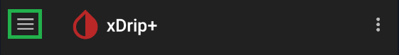

!!!xdrip "`CareLink Follower`"  
      
    &ensp;Settings  
    &emsp;Hardware Data Source  
    &ensp;&emsp;CareLink Follower

 

!!!warning  
    Carelink server are subject to frequent modifications that might break the feature.  
    Consider using [Companion app](/install/companion) on the master phone and xDrip+ [Sync](/install/xdripfollower) or Nightscout to share data.  
    The CarePartner app authentication is valid for 1 week, thus even if xDrip+ is unable to connect to CareLink for a few days (for example due to the lack of internet connection), it will be able to renew the login (refresh the token) automatically in the background after it can connect to CareLink again without needing to login again manually using the browser. The user account restriction applies to this authentication process as well:   
    **a dedicated follower account must be used for xDrip+, you cannot use the same follower for other apps or phones.**

 

!!!xdripitem "CareLink Country"  
    &ensp;Select your CareLink country

!!!xdripitem "CareLink Patient Username"  
    &ensp;CareLink patient username

Set patient username if using a care partner account with multiple patients.

!!!xdripitem "Login"  
    &ensp;Login with browser

xDrip+ will open the CareLink autentication web site, enter your credentials to login.  

!!!xdripitem "Grace Period"  
    &ensp;Grace period for data request in seconds

Grace period is an additional waiting time after receiving last reading + 5 minutes.  
Used to avoid server lock if xDrip+ performs too frequent requests.

!!!xdripitem "Missed data poll interval"  
    &ensp;Grace period for data request in seconds

Missed data polling interval is an additional waiting time after received last reading + 5 minutes + grace period.  
Used to avoid server lock if xDrip+ performs too frequent requests.

 

#### Treatments

You can download treatments and receive notifications.

!!!xdripitem "Finger BGs&emsp;&emsp;&emsp;&emsp;&emsp;&emsp;&emsp;🗹"  
    &ensp;You can download finger BGs from CareLink  

!!!xdripitem "Boluses&emsp;&emsp;&emsp;&emsp;&emsp;&emsp;&emsp;&emsp;🗹"  
    &ensp;You can download boluses from CareLink

!!!xdripitem "Meals&emsp;&emsp;&emsp;&emsp;&emsp;&emsp;&emsp;&emsp;&emsp;🗹"  
    &ensp;You can download meals from CareLink

!!!xdripitem "Notifications&emsp;&emsp;&emsp;&emsp;&emsp;&emsp;🗹"  
    &ensp;You can download notifications from CareLink

 

#### Status line

!!!xdripitem "External Status&emsp;&emsp;&emsp;&emsp;&emsp;🗹"  
    &ensp;Dusplay status from other apps like AndroidAPS

!!!xdripitem "Pump Status&emsp;&emsp;&emsp;&emsp;&emsp;&emsp;🗹"  
    &ensp;Display pump status information if available

Sensor status and pump status are available in [Extra status line](/use/lesscommon#extra-status-line) option.

Pump information (status, basal) is only visible in the status line and cannot be uploaded to Nightscout/Tidepool.

 

If no data is visible and no error message pops-up you might need to [Start sensor](/use/startsensor#followers-and-companion-apps).

[*Last modified 3/8/2024*](https://github.com/NightscoutFoundation/xDrip/releases/tag/2024.08.02)

