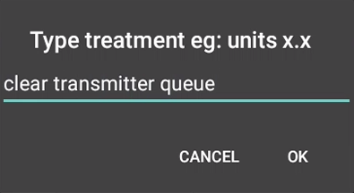

## Use only one device

If you have a receiver or normally use the vendor app, it's now time to decide which device you will want to use to start and stop your sensors. Use only one and make sure the other devices are either turned off or stored in a shielding bag (or a microwave oven turned OFF). When starting a sensor, do not let the receiver interact before warm-up is complete and you have readings in xDrip+.

 

At this point make sure you have a sensor inserted (already started or a new one not started yet) with the transmitter attached. You will not be able to connect to the transmitter if it is not attached to the sensor.

 

## Check connection

Reference documentation [here](https://navid200.github.io/xDrip/docs/Proper-connectivity.html).

`Menu` / `System Status`

Once on this page (that does not refresh real time) swipe leftwards to display `G5/G6 Status`

xDrip+ will first try try to find the transmitter. Keep it close to the phone and leave the app on this page.

Once found it will try to connect to it. If xDrip+ doesn't find it, check again the transmitter code.

!!!note  
    The sensor will comunicate every 5 minutes, the rest of the time it will be sleeping.  
    Last connected should **not** be more than 5 minutes. If it doesn't connect check your [settings](../g6).

 

## Command queue

Commands are processed by the transmitter one by one when received. Interactions occur every 5 minutes so it might take some time before they get processed. If you still see them pending after 20 minutes you might want to check connectivity and then delete them manually.

Do not attempt to send start or stop commands if the queue is not empty.

From the main view, touch the syringe (treatments) icon.

Long touch the microphone icon. 

Write `clear transmitter queue` then `OK`.

 

Proceed [here](../../sensor/G5G6sensor) to start your sensor.
