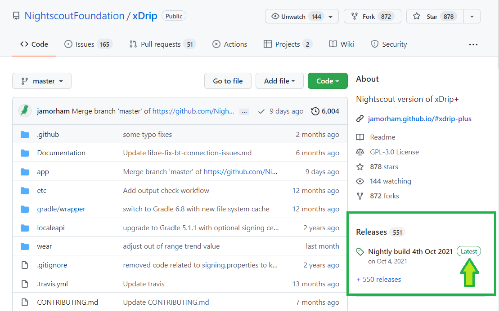

## Which one to install?

xDrip+ is not available in the Google Play store. You will find all releases in [Github](https://github.com/NightscoutFoundation/xDrip/releases).  
You have two main choices when installing xDrip+, either install the Latest release or a Pre-release.

!!!note  
    If you already have xDrip+ installed on your phone you don't need to uninstall it before installing another version.

### Latest release

Latest release is a stable version of xDrip+. It doesn't have all the newest features but has proven stability and doesn't suffer severe bugs. It's a safe version to start with.

You can download it from [here](https://xdrip-plus-updates.appspot.com/stable/xdrip-plus-latest.apk) or follow this QR code:

You will also find it in the [main repository](https://github.com/NightscoutFoundation/xDrip) selecting Latest.

### Pre-release

Pre-release include most recent xDrip+ developments like translations, new features and bug fixes. And it might also contain some bugs... Still, it is the version you want to use to benefit most recent improvements.

All xDrip+ versions are available [here](https://github.com/NightscoutFoundation/xDrip/releases).

Expand the assets and select the `.apk` file. You will find it in your phone's `Downloads` directory.

!!!note  
    Do **not** use Facebook links to download xDrip+ but **copy and paste the link** into a browser (like Chrome).

 

## Private versions

Some developers add features and customizations that are not available in the official pre-releases until the author will create a Pull Request in xDrip+ and get it merged in the main project.

!!!warning "Updating private versions"  
    You can use these versions but need to understand they might be supported only by their creator.  
    xDrip+ automatic updates won't work with private versions.  
    Also keep in mind you cannot install a private version if you have an official version installed on your phone:  
    you will need to uninstall it first.  
    The same applies for the other way round (from private to official).

Artem's private versions supporting various smartbands are available [here](https://bigdigital.home.blog/category/xdrip/) to download.

Bence's private versions for CareLink follower is also available [here](https://github.com/benceszasz/xDripCareLinkFollower/releases).

 

Once downloaded proceed to [installation](../install)

