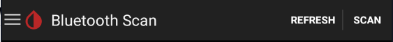
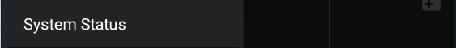

# G4 setup

!!!note  "Legacy sensor/transmitter"  
    G4 sensors are compatible with G5 transmitters. Consider using a rebatteried transmitter.

 

Looking for legacy documentation? [Here](https://nightscout-user-guide.readthedocs.io/en/latest/docs/grundlagen/xdrip.html).

 

## Setup the data source

G4 transmitters use radiofrequencies and not Bluetooth.

You need a bridge device to convert the signal to Bluetooth in order to be able to receive it with your phone.  
If you have a Dexcom Share receiver you can use it as a bridge.

If you're using a Wixel select the type:

[Bluetooth Wixel](https://github.com/StephenBlackWasAlreadyTaken/xDrip/wiki/xDrip-Wireless-Bridge)  
[xBridge Wixel](https://github.com/jstevensog/wixel-sdk/blob/master/apps/xBridge2/xBridge2.pdf)  

If required (xBridge only) enter the transmitter code.

Then pair it to Bluetooth using xDrip+: scan Bluetooth and select it from the list.

 

If you're using a [Wifi Wixel](https://github.com/jamorham/python-usb-wixel-xdrip) (combination of BT Wixels and Wifi Wixels), enter the list of receivers as a coma separated list.

Wifi Wixel / [Parakeet](https://jamorham.github.io/#xdrip-plus)  
Wifi Wixel + BT Wixel  
Wifi Wixel + Bridge Wixel  

[yDrip](https://github.com/Cagier/wixel-yDrip)  

 

If you're using a Bluetooth G4 Share receiver (Platinum) you can also pair it with Bluetooth to xDrip+.  
Enter the receiver serial number or use the phone camera to scan the barcode (you need to authorize camera access to xDrip+).

 

## Verify connection

`Menu` / `System Status`

Make sure your bridge is connected before continuing. System status doesn't refresh automatically, use the rounded arrows to refresh or swipe to the next page `BT Device` to see it real time.

## Start sensor

xDrip+ will send a start command to the sensor only if you use a bridge. With the receiver you need to "start the sensor" only to synchronize date and time, xDrip+ won't start neither stop it in this case.

Confirm `START SENSOR`

If you inserted the sensor today (i.e. not started or recently started), answer `YES, TODAY`

Else select the day you started the sensor.

If you answered today select the hour you physically started the sensor dragging the blue pointer to the correct time. With 12 hours display, tap `am` or`pm`. With 24 hours display drop the correct hour either on the inner or outer ring for the correct hour. Tap `OK`.

Drag the minutes blue pointer to the correct time and tap `OK`.

The newly started sensor will continue its warm-up if started from less than two hours. You will get purple arrow indications on the current BG trend based on raw values (bridges only).

If you're using an already started sensor you will have a calibration request within 15 minutes.

 

xDrip+ will now wait for readings and update the progress. Stay on this screen. Every reading is done 5 minutes apart so it should take less than 20 minutes.

The indication ***No data received yet*** will change to ***Need 3 recent readings***. If no data is received, [check your parameters](../../install/libreBT/#bridge-settings).

When enough readings are received, the calibration request will display.

If your BG is within normal range (recommended in the lower normal range for a new sensor) and has been stable for the last 10 minutes, with no carbs not insulin active, you can calibrate.

If your BG is quickly varying or not within normal range, it is not recommended to calibrate now. 

You BG should start displaying on the main graph.

 

[*Last modified 28/3/2022*](https://github.com/NightscoutFoundation/xDrip/releases/tag/2022.03.27)
