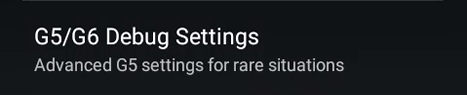

# G6/ONE setup

  
  
  

Reference documentation is [here](https://navid200.github.io/xDrip/docs/Dexcom_page.html).

!!!warning "**NEVER STOP A G6/ONE SENSOR UNLESS YOU ACTUALLY PLAN TO REMOVE IT**"  
    Every time you will want to perform a ***Stop Sensor*** operation, ask yourself **"Do I really want to do that?"**.  
    On the other hand, "starting" a sensor that is already started won't harm **unless you change the calibration code**.  
    G6 sensor restart is not a simple stop and start operation.      
     

 

!!!warning  
    Do not attempt to start a sensor before verifying settings and [connection](../../troubleshoot/connection/).  
    Check [system status](../../troubleshoot/systemstatus/) when running into trouble.  
    Follow the steps below without skipping them.  
    Even if xDrip+ insists you should start the sensor, do **NOT** start it before you've setup everything correctly.  Hit the back button to get rid of the message until instructed to start the sensor.

### Verify your settings

If you haven't yet, [check xDrip+ will not be put to sleep](../install/#make-sure-xdrip-will-not-be-put-to-sleep) (then come back here).

Enter the correct transmitter code, verify it.  
Take a picture of the transmitter code: since it's written below this will avoid you having a bad time recovering it if you lose it.

Carefully check your settings.

Do **NOT** enable restart sensor.

With Android versions below 10 disable `Avoid Scanning`.  
With Android versions 10 and above, if you experience disconnections you can try to disable first `Avoid Scanning` and eventually also `Minimize Scanning`.

If you use a Samsung phone with Android 11 and above, you should enable this.

Manual slot selection is not yet normally available.

 

`Menu` / `Settings` / `Less Common Settings` / `Bluetooth Settings`

!!!info  
    Mind the Bluetooth watchdog and G5 Bluetooth watchdog with turn off then on your phone Bluetooth, this will lead to a temporary Bluetooth disconnection on all connected devices. You might want to disable this feature if you use AAPS and your bridge/pump doesn't recover automatically Bluetooth connection.

For Samsung phones you must disable `Trust Auto-Connect`! If your phone is not a Samsung but loses connection you can try to disable it too.

For Android version 8 and above you can enable `Use Background Scans`. If you lose connection, leave it disabled.

  
  

#### Disable [automatic calibration](../../calibrate/advancedcal/#automatic-calibration).

 

Restart your phone to make sure all parameters are being taken into account.

### Check connection

Insert the transmitter in your sensor.  
You will not be able to connect xDrip+ if the transmitter is not is not inserted in the sensor.

Now go to [system status](../../troubleshoot/connection) and make sure the transmitter is connected.

Do not continue until battery information is available.

Once connection is confirmed proceed to [start sensor](../../use/startsensor/#g4-with-bridge-g5-and-g6).

 

[*Last modified 13/7/2022*](https://github.com/NightscoutFoundation/xDrip/releases/tag/2022.07.13)
