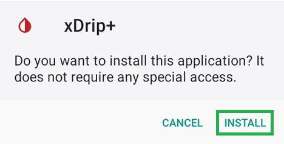
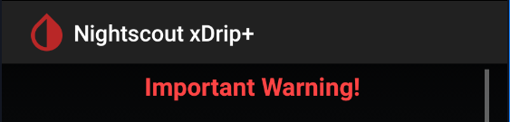
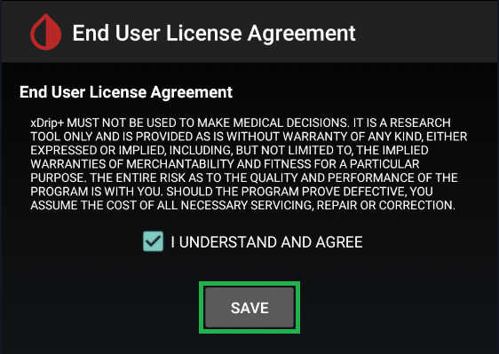
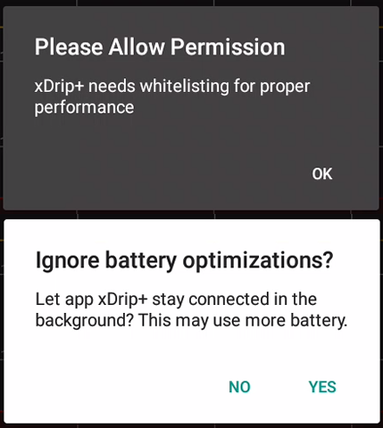
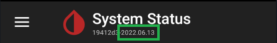
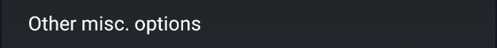
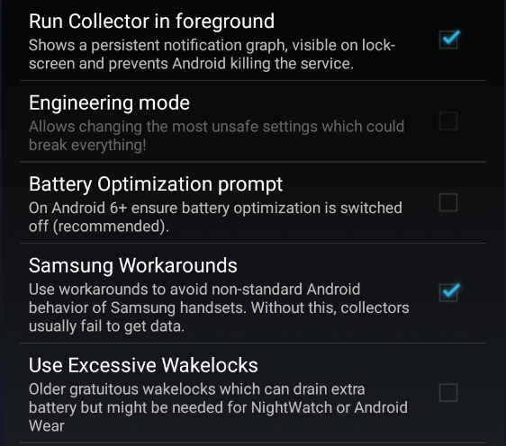

Once downloaded, install the xDrip+ apk.

**You need to [authorize installation of apps from unknown sources](https://developer.android.com/distribute/marketing-tools/alternative-distribution#unknown-sources) in Android security settings.**  
The official versions of xDrip+ are virus and malware free: being open source and controlled by the main developer make its distribution safe if you download it from GitHub.

Once installed, open xDrip+.

### Understand what is xDrip+

**Read** the important Warning.  

!!!warning "Make sure you fully understand the conditions before selecting `I Agree`."  
    Do NOT use or rely on this software or any associated materials for any medical purpose or decision.  
    Do NOT rely on this system for any real-time alarms or time critical data.  
    Do NOT use or rely on this system for treatment decisions or use as a substitute for professional healthcare judgement.  
    All software and materials have been provided for informational purposes only as a proof of concept to assist possibilities for further research.  
    No claims at all are made about fitness for any purpose and everything is provided **AS IS**. Any part of the system can fail at any time.  
    Always seek the advice of a qualified healthcare professional for any medical questions.  
    Always follow your glucose-sensor or other device manufacturers\' instructions when using any equipment; do not discontinue use of accompanying reader or receiver, other than as advised by your doctor.  
    This software is not associated with or endorsed by any equipment manufacturer and all trademarks are those of their respective owners.  
    Your use of this software is entirely at your own risk.  
    No charge has been made by the developers for the use of this software.  
    This is an open-source project which has been created by volunteers. The source code is published free and open-source for you to inspect and evaluate.  
    By using this software and/or website you agree that you are over 18 years of age and have read, understood and agree to all of the above.

 

**Read** the EULA.  

!!!warning "Make sure you fully understand it before saving."  
    xDrip+ MUST NOT BE USED TO MAKE MEDICAL DECISIONS.  
    IT IS A RESEARCH TOOL ONLY AND IS PROVIDED "AS IS" WITHOUT WARRANTY OF ANY KIND, EITHER EXPRESSED OR IMPLIED, INCLUDING, BUT NOT LIMITED TO, THE IMPLIED WARRANTIES OF MERCHANTABILITY AND FITNESS FOR A PARTICULAR PURPOSE.  
    THE ENTIRE RISK AS TO THE QUALITY AND PERFORMANCE OF THE PROGRAM IS WITH YOU.  
    SHOULD THE PROGRAM PROVE DEFECTIVE, YOU ASSUME THE COST OF ALL NECESSARY SERVICING, REPAIR OR CORRECTION.

 

### Authorize background activity

xDrip+ must have the right to run in background: it must be whitelisted to battery optimization. This is essential to a correct functioning. It should ask you to allow this authorization. If it doesn't or you need to verify this later, you'll have to check it in your phone `Settings` - `Apps` - `xDrip+`. Consult your phone manual as  it will depend on Android version and manufacturer.

 

### Authorize notifications

xDrip+ needs to access phone notifications to perform as expected.

 

## Verify which version is installed

Touch the back button on your phone until you're back to the main screen. Select the hamburger menu top left then `System Status`.

Current version will be displayed after `Version`. In the example below, January 28th 2022.

On most recent versions, you will find it on all system status pages.

See [here](../../use/update/) for upgrade or downgrade.

 

## Make sure xDrip+ will not be put to sleep

These settings are default, but still make sure they are exactly like shown below. Any time your phone will update, come back and check again: disable and enable checkboxes that should be enabled to enforce the settings.

`Menu` / `Settings` / `Less Common Settings` / `Other misc options`

`Run Collector in Foreground` enables the graph in your phone drop down curtain but is **essential** to keep the app alive.

`Battery optimization prompt` should be **disabled** as you should have agreed to [battery whitelisting](#authorize-background-activity) during install.

If you have a Samsung phone allow Samsung workarounds to fix a Samsung non compliance to Android specifications. This should enable automatically. You can also enable this option on other brands.

### Enable location

For newer Android versions (6 and above), location is [mandatory](https://developer.android.com/training/location/permissions) to allow Bluetooth Low Energy connection.  
If you will use xDrip+ with a Bluetooth sensor or bridge you **must** enable location (Android Settings -> [Location](https://support.google.com/android/answer/3467281)) and authorize xDrip+ to access it. Consult your phone manual as it will depend on Android version and manufacturer.

 

Proceed to [data source selection](../datasource)

 

[*Last modified 3/2/2023*](https://github.com/NightscoutFoundation/xDrip/releases/tag/2023.02.26)
