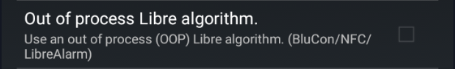
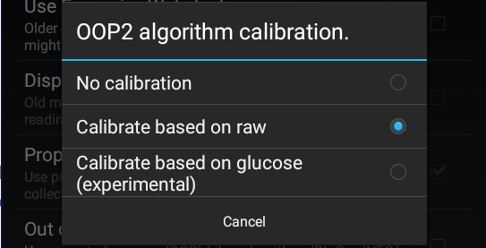

# Libre 2 Direct

This describes how to enable direct Bluetooth connection between the sensor & xDrip+, without the need for a bridge.

## Setting Up for the first time

(Click [Start Sensor](#starting-libre-2-sensors) for subsequent sensors).

!!!info "Only Libre 2 Europe sensor model is supported"
  
  
  

Libre 2 reference documentation is [here](https://www.minimallooper.com/post/how-to-setup-freestyle-libre-2-and-oop2-to-use-a-native-bluetooth-connection-in-xdrip).

 

!!!warning  
    **Uninstall any app connected to the sensor and shield the reader before attempting to connect to xDrip+.**  
    If you connect your sensor directly to xDrip+ you will permanently lose alarms on the vendor app or reader without possibility to recover.  
    If you're not sure this will work, use a sensor at end of life to test the system.  
    Like Libre bridges, success and reliability will vary depending on your phone.  
    Linking your sensor to xDrip+ will void the vendor warranty on the sensor Bluetooth feature.

## Prerequisites

The phone on which you installed xDrip+ has an NFC reader.

If the vendor app is installed on the same phone you're using for xDrip+, **you uninstalled it**.  
If it is installed on another phone or you're using the Bluetooth reader, you've put these devices far away, or shielded them so that they won't interfere.

## Setup xDrip+

### QR Codes - Click image to expand
No Calibration             |  With Calibration
:-------------------------:|:-------------------------:
 | 

As a short-cut, you can scan the QR code shown here to load the settings needed for Libre 2 direct. (This has calibration turned off - recommended for beginners. If instead you want calibration, [follow this](../libre2direct-calib)). Under Settings in the left hand "hamburger" menu, select "Auto configure" and capture the QR code. You will need to press the Yes button to confirm that you want to import these settings. The full list of these imported settings are shown [here](../libre2direct-qr-settings).
Now skip to [Starting Libre 2 Sensors](#starting-libre-2-sensors)

## Manually changing settings..
Configure NFC exactly [like this](../libreNFC/#enabling-nfc).

In Starting Bluetooth connection with Libre2 sensors, allow xDrip+ to always connect with Libre 2 sensors.

Install the right [Out Of Process Algorithm (OOP2)](../../use/OOP/#oop2) and [configure it in xDrip+](../../use/misc/#out-of-process-algorithm).

Verify xDrip+ [Bluetooth settings](../libreBT/#bridge-settings) are correct.

Now continue below...

## Starting Libre 2 Sensors

Physically insert your Libre2 sensor & start it with the very first NFC scan using either the reader device, or LibreLink. Make a ote of the time that the sensor will be ready. If using the same phone as xDrip, disable LibreLink on the phone. You should see BG values when scanning it. Now wait 60 minutes until the sensor has warmed up and self-calibrated.

### Connect to the sensor

Open xDrip+
If you have a previous sensor connected to xDrip+, [stop](../../use/stopsensor) the old sensor.

Confirm you really want to stop the sensor.

Scan the sensor with xDrip+ [NFC](../libreNFC) feature and make sure you see the toast messages "Scanning.." & then  "Scanned OK!".

!!!note  
    Hold the phone steady when scanning the sensor and don't move it: it's taking longer than reading the sensor as you usually do with the vendor app.  
    Remember you should wait one minute between two successful NFC scans.

Start the sensor in xDrip+.

Confirm `START SENSOR`. 

At the prompt **Did you insert it today?** You must press **NOT TODAY**

Wait 60 seconds & NFC scan again with xDrip+. This adds the sensor as the BT device that xDrip+ will take the readings from. Expect to see NEW SENSOR STARTED notification. If you are set to No Calibration", you should see the first reading immediately. If you have set Calibration, you should then be in the "Collecting Initial Readings" screen.
You will now need to wait between 3 and 15 minutes for 3 readings to be received, and then you will be taken to the **Calibrate Sensor?** prompt.
After entering the calibration data, the Libre 2 sensor should be bonded to xDrip+, and should deliver readings every 5 minutes.

You can confirm that all is working by comparing to "How it should look" [here](../../troubleshoot/libre2direct/## What it should look like)

If you have trouble getting data directly from the sensor, scan it every 5 minutes with xDrip+ NFC until you reach the calibration request (applies if you selected the [calibration option](../../use/misc/#oop2) with OOP2).

 

[*Last modified 6/6/2023*](https://github.com/NightscoutFoundation/xDrip/releases/tag/2023.05.26)

