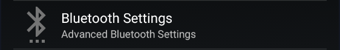

!!!info "Only Libre 2 Europe sensor model is supported"

!!!note  
    Reference documentation [here](https://www.minimallooper.com/post/how-to-setup-freestyle-libre-2-and-oop2-to-use-a-native-bluetooth-connection-in-xdrip).

## Settings

Verify your settings are correct.

`Menu` / `Settings` / `Less Common Settings` / `Bluetooth Settings`

For Samsung phones disable `Trust Auto-Connect`!

For Android version 8 and above you can enable `Use Background Scans`

If you have connection losses you can enable polling mode. It will not do anything useful but keep the Bluetooth link awake.

 

## Enable NFC scan

See [here](../libreNFC/#enabling-nfc) for details. Match exactly the settings.

Select Starting Bluetooth Connection with Libre 2 sensors

And set it to: Always connect to Libre 2 sensors.

Restart your phone to make sure all parameters are being taken into account.

 

## Start the sensor

Use the vendor app, or the reader to start the sensor. There are no alternative solution.  
Wait until the sensor is actually started and you can read your BG.

Remove location authorization to the vendor app, if your started the sensor with the Bluetooth reader make sure to shield it before continuing.

!!!warning "Sensor warranty"  
    Connecting a Libre 2 to xDrip+ will **disconnect Bluetooth from the vendor app or the sensor reader without possible recovery**. Make sure you understand the implications on sensor warranty.

