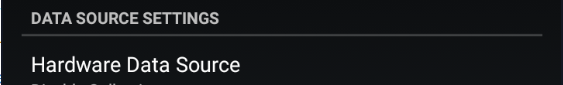

  
  
  

!!!info "Only Libre 2 Europe sensor model is supported"

Follow these guidelines: [https://androidaps.readthedocs.io/en/latest/Hardware/Libre2.html](https://androidaps.readthedocs.io/en/latest/Hardware/Libre2.html)

 

#### Juggluco

If you use [Juggluco](https://play.google.com/store/apps/details?id=tk.glucodata) you can broadcast to xDrip+ enabling Send to xDrip. You must have data streaming in Juggluco in order to see measurments in xDrip+.

If no data shows in xDrip+, "start" a sensor to allow BG display.

Confirm `START SENSOR`

Answer `NOT TODAY`

 

[*Last modified 24/5/2022*](https://github.com/NightscoutFoundation/xDrip/releases/tag/2022.05.19)
