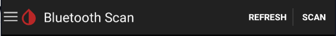

  
  
  

# Libre and bridge

Many NFC to Bluetooth bridges are available on the market for Libre sensors.

The original project was developed by Joern: [LimiTTer](https://github.com/JoernL/LimiTTer). You need to remember this name as it will appear as the default bridge name when the actual device is not identified. Unless you actually have a LimiTTer (or connect directly a Libre 2), seeing this name means your bridge is not connected to xDrip+.

xDrip+ supports some of them for some sensors.  
**Libre H, Libre 2 US/CA/AUS are not supported.**  
You can use Diabox in [Nightscout follower](../nightscoutfollower/#diabox) mode.

Here below a compatibility table for supported bridge devices, for compatible sensors **minimum** firmware version is indicated.

|   Bridge    | - Libre 1 / Pro - | - 14 days US - | - Libre 2 EU - |
| :---------: | :---------------: | :------------: | :------------: |
|   BluCon    |       `Yes`       |     `4.2*`     |     `4.2*`     |
|  MiaoMiao   |       `Yes`       |     `39*`      |     `39*`      |
| MiaoMiao 2  |       `Yes`       |      `7*`      |      `7*`      |
| MiaoMiao 3  |       `Yes`       |     `3A*`      |     `3A*`      |
|   Bubble    |       `Yes`       |     `2.6*`     |     `2.6*`     |
| Bubble mini |       `Yes`       |     `2.6*`     |     `2.6*`     |
|   Droplet   |       `Yes`       |      `No`      |     `2.2*`     |
|    Atom     |       `Yes`       |                |                |

*Note:*  
*`*` [external add-on required](../../use/OOP)*

 

## Bridge settings

Before trying to connect your bridge verify your settings are correct to avoid frequent disconnections.

`Menu` / `Settings` / `Less Common Settings` / `Bluetooth Settings`

Use settings as shown below to start with.

If your bridge loses connection and scanning Bluetooth allows you to recover, you can try to enable `Use scanning`.

For Samsung phones you must disable `Trust Auto-Connect`! If your phone is not a Samsung but loses connection you can try to disable it too.

For Android version 8 and above you can enable `Use Background Scans`. If you lose connection, leave it disabled.

If your bridge is a Transmitter_T or a Droplet enable this else keep it disabled.

If you have connection losses you can enable polling mode. It will not do anything useful but keep the phone Bluetooth awake.

If your bridge is a BluCon you can enable this.  
*Note: only BluCon bonds to Android, other bridges don't.*

 

Restart your phone to make sure all parameters are being taken into account.

 

## Connect Bluetooth bridge

Make sure your bridge is not connected to anything else: any other device and any other app.  
Scan Bluetooth.

`Menu` / `Bluetooth Scan` 

If your bridge doesn't show up make sure it's fully charged (or has a new battery) and reset it.

Once visible select it.

If your bridge is a Blucon enter the code written on the side. 

Position it correctly on your sensor. Some bridges have very little tolerance in respect with angle and distances to the sensor.

!!!info "External Add-on"  
    If your sensor requires an [out of process algorithm](../../use/OOP), make sure it is installed now.

 

## Start Libre sensor

xDrip+ is not able to start a Libre sensor, neither is it to stop one (actually you can't stop this sensor: if it doesn't fail it will run it's useful lifetime and stop by itself after 14 days and 12 hours).

In order to start your sensor you need to use the vendor reader or app, some other third party apps like Glimp-S and eDropletNFC can start the Libre sensor.

xDrip+ sensor start is only used to track lifetime and make sure calibrations are updated. This operation is necessary and recommended each time you replace your sensor.

 

Confirm `START SENSOR`

If you inserted the sensor today (i.e. not started or recently started), answer `YES, TODAY`

If you answered today select the hour you physically started the sensor dragging the blue pointer to the correct time. With 12 hours display, tap `am` or`pm`. With 24 hours display drop the correct hour either on the inner or outer ring for the correct hour. Tap `OK`.

Drag the minutes blue pointer to the correct time and tap `OK`.

The newly started sensor will continue its warm-up if started from less than one hour.

!!!warning  
    **Even if xDrip+ will attempt reading a sensor during its warm-up phase, values can range from unreliable to inconsistent and should not be used.**

If you're using an already started sensor you will have a calibration request within 15 minutes. If you see a purple arrow you might have made a mistake in the date and time the sensor was started as BG data is available but won't display during the 1 hour warm-up.

 

xDrip+ will now wait for readings and update the progress. Stay on this screen. Every reading is done 5 minutes apart so it should take less than 20 minutes.

If the data source shows LimiTTer and you're not using an actual [LimiTTer](https://github.com/JoernL/LimiTTer), your bridge device is not connected correctly.

The indication ***No data received yet*** will change to ***Need 3 recent readings***. If no data is received, [check your parameters](../../install/libreBT/#bridge-settings).

When enough readings are received, the calibration request will display. More about calibration [here](../../calibrate/101).

If your BG is within normal range (recommended in the lower normal range for a new sensor) and has been stable for the last 10 minutes, with no carbs not insulin active, you can calibrate.

If your BG is quickly varying or not within normal range, it is not recommended to calibrate now. 

Two readings are required from legacy G4 receiver, you can use only one if you're sure it's valid. Just put twice the same value.

You BG should start displaying on the main graph.

 

## Stop Libre sensor

xDrip+ cannot physically stop a Libre sensor, it will stop running by itself after 14 days and 12 hours and keep showing the last value.

Still, when changing sensor it is strongly recommended to inform xDrip+ of the change by stopping the sensor.

Confirm you really want to stop the sensor.

This will reset all calibrations and allow xDrip+ to start a new sensor.

 

[*Last modified 27/4/2022*](https://github.com/NightscoutFoundation/xDrip/releases/tag/2022.04.27)