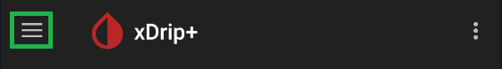

!!!xdrip "`Nightscout Follower`"  
      
    &ensp;Settings  
    &emsp;Hardware Data Source  
    &ensp;&emsp;Nightscout Follower

### Nightscout

!!!xdripitem "Nightscout Follow URL"  
    &ensp;Web address for following 

For using xDrip+ with data coming from your [Nightscout](https://nightscout.github.io/) site, you only need to enter your site URL.

With a classic DIY Nightscout, the URL will look like this: `https://sitename.yourprovider.com`  
Do not add `/api/v1`  
Make sure to use `https` not `http`

If you use a hosted service contact the vendor for more information.

If your Nightscout site is [secured](https://nightscout.github.io/nightscout/security/), you need to add the API_SECRET or a token information.

`https://API_SECRET@sitename.yourprovider.com`

`https://access_token@sitename.yourprovider.com`

!!!xdripitem "Download Treatments&emsp;&emsp;&emsp;&emsp;&emsp;&emsp;🗹"  
    &ensp;Also download treatments from Nightscout as follower

You can also download compatible treatments from Nightscout (BG, calibrations, treatments, notes).

 

xDrip+ performs limited (24 hours) data backfilling from Nightscout.

### Diabox

You can receive data from [Diabox](https://sirius.thetaphi.de/diabox/) by enabling http broadcast in the app and making xDrip+ a local follower.

!!!warning  
    You cannot use this feature with xDrip+ running a [web service](../../use/interapp/#web-service).

Once done set xDrip+ in Nightscout follower (see above) with the address:

`http://localhost:17580`

 

[*Last modified 4/8/2024*](https://github.com/NightscoutFoundation/xDrip/releases/tag/2024.08.02)
