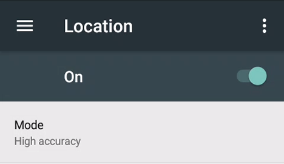

You need an Android phone.

- Minimum supported Android version is 4.4 but 6 and above is recommended.
- If you will connect xDrip+ to a sensor your phone must support Bluetooth Low Energy (BLE): you can use utilities [like this one](https://play.google.com/store/apps/details?id=com.treeteam.blechecker) to check.
- If you want to use the embedded master - follower function of xDrip+ (called xDrip+ Sync) both phones must have [Google Play Services](https://play.google.com/store/apps/details?id=com.google.android.gms) installed.
- In order to use NFC scanning features for Libre 1 and 2 (EU only) sensors, or to connect directly to a Libre 2 (EU) sensor your phone needs a compatible NFC reader.
- If using Android 10 and above make sure you use a recent version of xDrip+ (at least the [latest release](../download/#latest-release), we'll talk about it later: continue reading).

### Google Play Services

​	

If your phone doesn't have Google Play Services (some Huawei and Chinese phones don't) you still can use xDrip+ but not the xDrip+ Sync function that relies on them as stated above.  
You can experience unexpected issues with alternative OS based on Android.  
In this case make sure you [disable Sync functions](../../use/sync/#disable-sync).

### Family Link

To install xDrip+ on a phone monitored by [Google Family Link](https://families.google.com/families) **you must disable it** until you've installed the app.  
If you want to enable it again afterwards make sure xDrip+ has all rights and no time limitations.

### Work profile

If you use a company controlled phone, you might not be able to install xDrip+ due to corporate policies.

You can try to sideload the app with [Android Debug](../../troubleshoot/ADB/#smartphone) using a computer after enabling developer options on your phone. Remember to delete xDrip+ in your work profile if necessary, as it might be installed in both environments.

### Phone time accuracy

Synchronize your phone clock to the network (Android Settings -> [Date & Time](https://support.google.com/android/answer/2841106)).  
Make sure you are on the correct time zone and daylight settings are correct.

### Energy savings

**Disable** all phone energy savings/battery Android settings before installing xDrip+.  
You can try to restore some after verifying xDrip+ is working correctly, never optimize xDrip+.

 

### Play protect

!!!note  
    Usually Google Play Protect doesn't stop xDrip+ but it might stop [OOP](../../use/OOP/).

If xDrip+ stops working every night between midnight and 3am, try to disable Google Play Protect.  
Since this is an important safety feature for your phone be sure to avoid using it to download unknown links and games: keep your CGM phone as safe as possible if you decide to disable Play Protect.

You will find Google Play Protect in your phone Play Store app's settings.

 

[Proceed to downloading xDrip+](../download)

 

[*Last modified 3/2/2023*](https://github.com/NightscoutFoundation/xDrip/releases/tag/2023.02.26)
