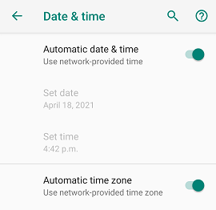

You need an Android phone.

- Minimum supported Android version is 4.4 but 6 and above is recommended.
- If you will connect xDrip+ to a sensor your phone must support Bluetooth Low Energy (BLE): you can use utilities [like this one](https://play.google.com/store/apps/details?id=com.treeteam.blechecker) to check.
- If you want to use the embedded master - follower function of xDrip+ (called xDrip+ Sync) both phones needs to have the [Google Play Services](https://play.google.com/store/apps/details?id=com.google.android.gms) installed.
- If you need to use NFC scanning features for Libre sensors, or want to connect to a Libre 2 (EU) sensor your phone needs a compatible NFC reader.
- If using Android 10 and above make sure you use a recent version of xDrip+.

### Family Link

If you need to install xDrip+ on a phone monitored by [Google Family Link](https://families.google.com/families) you must disable it until you've installed the app.

### Work profile

If you use a company controlled phone, you might not be able to install xDrip+ due to corporate policies.

You can try to sideload the app with [Android Debug](https://developer.android.com/studio/command-line/adb) using a computer after [enabling developer options](https://developer.android.com/studio/command-line/adb#Enabling) on your phone.

### Phone time accuracy

Synchronize your phone clock to the network (Android Settings -> System -> Date & Time).  
Make sure you are on the correct time zone and daylight settings are correct.

### Enable location

For newer Android versions (6 and above), location is [mandatory](https://developer.android.com/training/location/permissions) to allow Bluetooth Low Energy connection.  
If you use xDrip+ with a Bluetooth sensor or bridge you **must** enable location and authorize xDrip+ to access it. Consult your phone manual as  it will depend on Android version and manufacturer.

### Energy savings

Disable all phone energy/battery savings before installing xDrip+.  
You can try to restore some after verifying xDrip+ is working correctly, never optimize xDrip+ itself nor Bluetooth if you use it to connect to a sensor.

