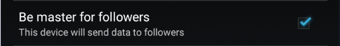
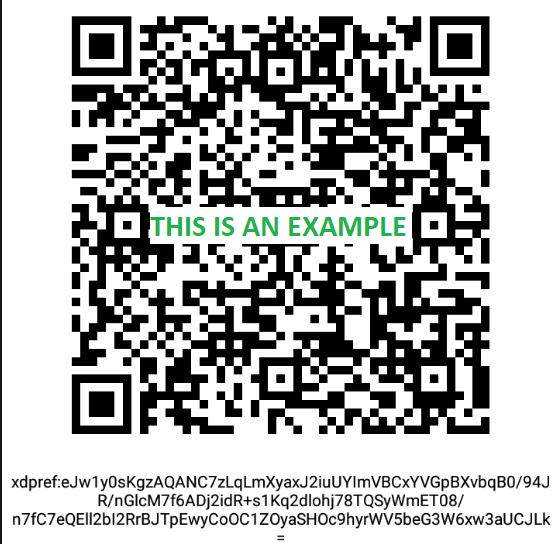
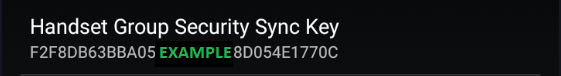
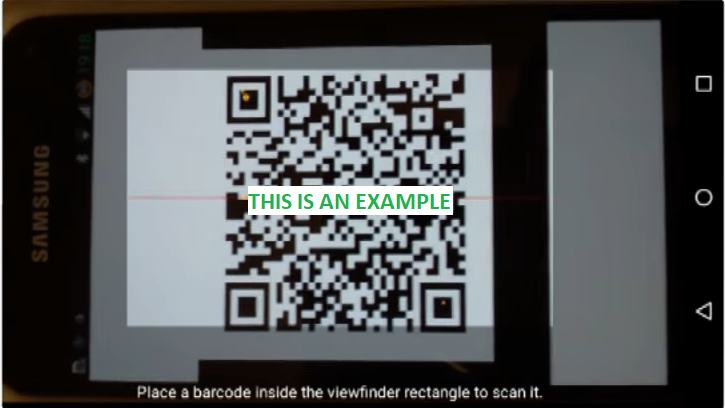

  
  
  

This is the reference video: [https://www.youtube.com/watch?v=LcgjfbYcWkE](https://www.youtube.com/watch?v=LcgjfbYcWkE)

 

### Prerequisites

xDrip+ master phone is the device that is actually getting directly glucose readings from a sensor, a bridge, an app.  
Having a follower device being xDrip+ sync master adds little value unless the follower device can't use the same data source.

Your master should receive data reliably. Always troubleshoot the master first if you don't have data on your follower.

### Setup master

Make the primary data source phone master (enable checkbox):

  
  
  

### Copy the Sync Key

#### Option 1 (recommended)

On the master phone display the Sync Key QR code:

  
  

  

Leave the master phone on this picture for the moment.

#### Option 2 (complicated)

Write down the master key.

  
  
   

### Copy the Sync Key from the master

#### Option 1 (recommended)

  

You need to authorize xDrip+ to access the phone camera.  
Scan the QR code displayed on your master phone.

#### Option 2 (complicated)

Edit the key field and type **exactly** the same key than the master.

### Setup follower

Make sure the follower phone is not master (disable checkbox).

Set the follower to xDrip+ Sync follower data source.

  
  
  
 

You might need to reboot the follower phone to validate everything and get data.

 

[*Last modified 29/3/2022*](https://github.com/NightscoutFoundation/xDrip/releases/tag/2022.03.28)
