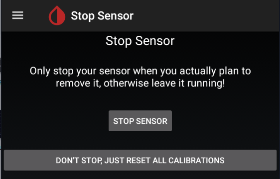

## Stop a sensor

Before starting a new sensor, the previous one should be stopped (only if you are replacing it). If the sensor is already started and you don't want to replace it, go ahead and start sensor anyway with xDrip+.

!!!warning "**DO NOT STOP A SENSOR UNLESS YOU WANT TO REMOVE IT.**"

Before stopping your sensor make sure the command queue is empty:

Check the status `Menu` / `System Status` 

If there are actions pending wait 20 minutes until they expire or get rejected.

Queued items remaining stuck might be because of bad settings preventing communication to the transmitter. Check your settings [here](../../install/g6/#g6-settings) and eventually [delete them](../../install/connectivity_G/#command-queue). 

Open the menu and select `Stop sensor`. If you only see `Start sensor` continue [below](#start-a-sensor-or-use-a-sensor-that-is-already-started) (don't start it yet).

Confirm `STOP SENSOR`

Check the status `Menu` / `System Status` and wait until your sensor stops.

The stop command will queue until next connection and then your sensor will stop. It might take more than 5 minutes. Do not send other commands until the queue is empty.

If you have commands stuck in the queue, [delete them](../../install/connectivity_G/#command-queue), check connection and stop sensor.

 

## Start a sensor or use a sensor that is already started

Starting a new sensor with xDrip+ or connecting a sensor started by the vendor app or the receiver is identical.

Open the menu and select `Start sensor`. If you only see `Stop sensor` go back [here](#stop-a-sensor).

Confirm `START SENSOR`

If you inserted the sensor today (i.e. not started or recently started), answer `YES, TODAY`

If you answered today select the hour dragging the blue pointer to the correct time. With 12 hours display, tap `am` or`pm`. With 24 hours display drop the correct hour either on the inner or outer ring for the correct hour. Tap `OK`.

Drag the minutes blue pointer to the correct time and tap `OK`.

Check the status `Menu` / `System Status` to monitor startup. You will see the start command queued until next connection.

!!!info "G6 only"

After the sensor start command is processed, xDrip+ will ask for the calibration code provided with the sensor (only non-started sensor).

The newly started sensor will start warm-up. You can see the remaining time in system status.

If you're using an already started sensor you will have readings within 10 minutes. If you see a purple arrow you might have made a mistake in the date and time the sensor was started as BG data is available but won't display during the 2 hours warm-up.

 

Once passed the warm-up you should receive a calibration request if the sensor is a G5, a G6 in non-native mode (not a Firefly sensor) or a G6 started without calibration code (G5 mode).