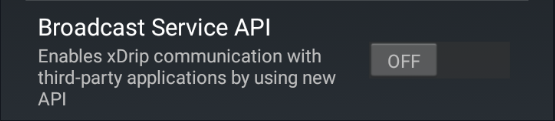

!!!xdrip "`MiBand`"  
      
    &ensp;Smart Watch Features  
    &emsp;  MiBand

xDrip+ Official Release supports MiBand 2, 3, 4 and broadcast to [WatchDrip+](https://bigdigital.home.blog/2022/06/16/watchdrip-a-new-application-for-xdrip-watch-integration) for other smartbands.

!!!note "Prerequisite"  
    Make sure you have BG readings in xDrip+ before trying to have them on your watch.  
    If xDrip+ doesn't receive readings on your phone, they won't be displayed on the watch.

## Install

### Obtain an authentication key

#### If you already paired your watch with the vendor app

- Unpair the watch.
- Uninstall MiFit or Zepp, or whatever app you used to connect your watch.

- **Delete the old key files** (use a file browser on your phone) in the phone memory `freemyband` folder.  
  Recommended if you can't get xDrip+ to connect to the watch.  
  *Note: the name below is an example*

#### Install the patched app matching your watch

Go to [https://www.freemyband.com/](https://www.freemyband.com/)

Download and install [Zepp](https://www.freemyband.com/2019/08/amazfit-gtr-auth-key.html) for Amazfit watches.  
(or)  
Download and install [MiFit](https://www.freemyband.com/2019/08/mi-band-4-auth-key.html) for Xiaomi smartbands.

Authenticate with mail and password. Create an account if necessary.

Pair your smartband.

Enable watch visibility. If you don't find this option make sure you have set your age to 18 and above.

Check a key file was created in the phone memory `freemyband` folder.

You can uninstall the patched app. This is not mandatory. If you want to install the original app, use the same email account to login.

## Not using WatchDrip+

!!!note "Only MiBand 2, 3 and 4"

### Setup xDrip+

Switch the MiBand feature on. Keep your watch close to your phone until it gets detected.

!!!xdripitem "Use MiBand&emsp;&emsp;&emsp;&emsp;&emsp;&emsp;&emsp;&emsp;&emsp;&emsp; →`ON`" 

Mac Address should populate automatically.

!!!xdripitem "Mac address (FF:EE:DD:CC:BB:AA)"  
    &ensp;Leave empty for auto search

**If it doesn't** (unexpected)**:**   
Delete the file(s) in the  `freemyband` folder.  
Open the patched watch app.  
Retry: switch off then on the MiBand feature.

You can also try to enter the watch mac address manually. You will find it in the filename in the `freemyband` folder.  
For example if the name is `mibandFFEEDDCCBBAA.txt` the corresponding mac address will be `FF:EE:DD:CC:BB:AA`.

Keep an eye on toast messages: during smartwatch authentication you should see the following:

If authorization fails, delete the file(s) in the `freemyband` folder and open the patched app to regenerate it.

If xDrip+ can't get the authentication key automatically, you can try to insert it manually. You will find it editing the file.

Make sure the watch is connected and matches the mac address before manually entering the key.

!!!xdripitem "Auth Key"  
    &ensp;Set the auth key for MiBand 4 (To get auth key, follow the instructions on [https://www.freemyband.com](https://www.freemyband.com/2019/08/mi-band-4-auth-key.html))

Once connected and authenticated, enable Send Readings. Wait for the next value in xDrip+, the watchface should update.

!!!xdripitem "Send readings&emsp;&emsp;&emsp;&emsp;&emsp;&emsp;&emsp;&emsp;&emsp;&emsp; →`ON`"   
    &ensp;Appropriate the watch date to show glucose values. Better with mmol/l - see documentation 

To force the watch to update, you can manually send a reading. Look carefully at toast messages.

!!!xdripitem "Update BG manually"  

If you have trouble displaying the graph, try to disable high MTU values.

!!!xdripitem "Disable high MTU values&emsp;&emsp;&emsp;&emsp;&emsp; `OFF`←"   

### Features

!!!xdripitem "Use MiBand Band →`ON`"   
    &ensp;Sync data with MiBand fitness bands

You can enable and disable MiBand integration with the main switch. When troubleshooting don't hesitate to turn it off then on to restart it.

!!!xdripitem "Mac address"  
    &ensp;Leave empty for auto search

The watch mac address should be detected automatically when the field is left empty. You can manually edit it and write the 6 two-digits hex values, colon separated, of your watch.

!!!xdripitem "Auth Key"  
    &ensp;Set the auth key for MiBand 4 (To get auth key, follow the instructions on [https://www.freemyband.com](https://www.freemyband.com/2019/08/mi-band-4-auth-key.html))

 When a valid mac address is found you will also see the key field. If it's not filled automatically you can manually enter the 32 characters authentication key.

!!!xdripitem "Send readings&emsp;&emsp;&emsp;&emsp;&emsp;&emsp;&emsp;&emsp;&emsp;&emsp; →`ON`"   
    &ensp;Appropriate the watch date to show glucose values. Better with mmol/l - see documentation 

You must enable this to have readings sent to the watch.

!!!xdripitem "Vibrate on readings&emsp;&emsp;&emsp;&emsp;&emsp;&emsp;&emsp;&emsp; →`ON`"  

!!!xdripitem "Send Alarms&emsp;&emsp;&emsp;&emsp;&emsp;&emsp;&emsp;&emsp;&emsp;&emsp;&emsp; →`ON`"   
    &ensp;Send notifications to the band for glucose alarms

!!!xdripitem "Send Calls&emsp;&emsp;&emsp;&emsp;&emsp;&emsp;&emsp;&emsp;&emsp;&emsp;&emsp;&emsp;&emsp; ✔"   
    &ensp;Send call notifications to the band (Android 6+)

You can enable various options to have the watch vibrate on readings, receive alarms or receive notifications as phone calls.

!!!xdripitem "Update BG manually"  

You can force watchface refresh using Update BG manually.

!!!xdripitem "MiBand Screens / Features"  

More customizations are available in this menu.

!!!xdripitem "Allow to use custom watchface&emsp;&emsp; `OFF`←"   

You can create your own watchface and modify the background image using these features.  
Keep them disabled unless you have correctly set the files required in the phone xdrip folder.

For tips and examples look [here](https://github.com/twinko).

!!!xdripitem "Disable high MTU values&emsp;&emsp;&emsp;&emsp;&emsp; `OFF`←"   

Disable High MTU can be used when experiencing watchface display issues.

## Using WatchDrip+

### Install [WatchDrip+](https://bigdigital.home.blog/2022/06/16/watchdrip-a-new-application-for-xdrip-watch-integration/)

!!!note "Disable MiBand in xDrip+ if you use WatchDrip+"

### Setup xDrip+

Enable Broadcast Service API in Settings -> Inter-app Settings

 

[*Last modified 4/8/2024*](https://github.com/NightscoutFoundation/xDrip/releases/tag/2024.08.02)
