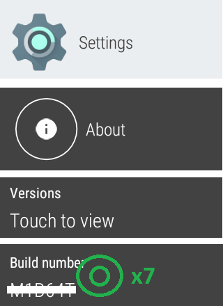

### Prepare your device for Debug

This step is mandatory to connect it through ADB with a physical connection. If your device doesn't have a physical USB connector you need to use ADB over Wi-Fi (documentation pending).

If you want to debug a smartphone skip to [here](#smartphone).

#### Smartwatch

1. Enable Developer Options  
   Settings -> About -> Versions -> Build Number  
   Tap 7 times on the build number version until the watch will display "you're a developer".   
     
2. Settings -> Developer Options -> ADB Debugging  
   Enable ADB Debugging  
   

#### Smartphone

1. Enable Developer Options  
   Settings -> About -> Software -> Build Number  
   Tap 7 times on the build number version until the watch will display "you're a developer".   
     
2. Settings -> Developer Options -> USB Debugging  
   Enable ADB Debugging  
   

### Install ADB on a Windows computer

1. Download [Android Debug Bridge](https://developer.android.com/studio/releases/platform-tools#downloads) on your computer.  
   `1` Open the Downloads folder  
   `2` Open the file you downloaded  
   `3` Select all files  
   `4` Copy them into the `5` adb folder you created in C:

   

2. Run a new command prompt window (`Start -> Run - > cmd`) with Administrator privileges.  
   

### Sideload an app with ADB in Windows

1. Connect your device (watch/phone) with an USB cable to your computer, unlock the screen.
2. Enter `cd \adb`  
   
3. Enter `adb devices`  
   
4. Look at the device connected and authorize debug, always.  
     
   
5. Enter again  `adb devices`  
     You should now see your device in the list.  
   
6. Copy the file you want to install in the C:\ADB folder (let's call it `myapplication.apk` as an example, if its name contains spaces rename it to something short and simple, like `oop.apk` or `xdrip.apk`).
7. Enter the command `adb install -r myapplication.apk` and wait for completion (replace `myapplication` with the name of your app).
8. The app should now be present on your device.

### Install ADB on a Mac

1. Download [Android Debug Bridge](https://developer.android.com/studio/releases/platform-tools#downloads) on your computer.  
   `1` Open the Downloads folder in Finder  
   `2` Right click the platform tools folder  
   `3` Select New Terminal at Folder

### Sideload an app with ADB in iOS

1. Connect your device (watch/phone) with an USB cable to your computer, unlock the screen.

2. Enter `./adb devices`  
   

3. Look at the device connected and authorize debug, always.    
     
   

4. Enter again  `./adb devices`  
     You should now see your device in the list.  

5. Copy the file you want to install in the platform tools folder (let's call it `myapplication.apk` as an example, if its name contains spaces rename it to something short and simple, like `oop.apk` or `xdrip.apk`).

6. Enter the command `./adb install -r myapplication.apk` and wait for completion (replace `myapplication` with the name of your app).

7. The app should now be present on your device.

### INSTALL_FAILED_VERSION_DOWNGRADE

This probably means the app is already present on your device with a more recent version.

Try to find it and uninstall it.

If there's no way to uninstall it try to sideload with the downgrade switch:

(Windows)	`adb install -r -d myapplication.apk`

(Mac)	`./adb install -r -d myapplication.apk`

 

[*Last modified 28/3/2022*](https://github.com/NightscoutFoundation/xDrip/releases/tag/2022.03.27)
