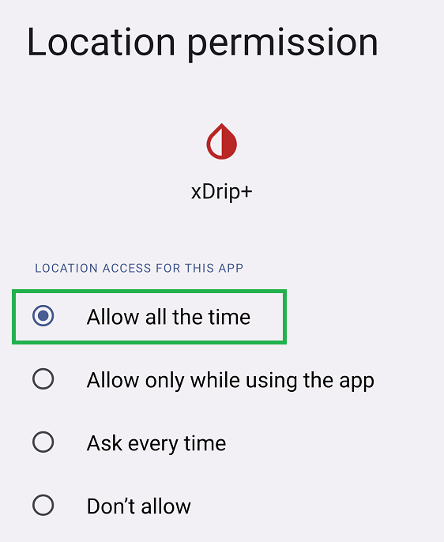

!!!info "Libre 2 EU"  
    Only the European version of Libre 2 is supported by xDrip+.  
    If you want to use Libre 2 from another geographical area, you can have data sent to xDrip+ from [another app](../../install/libre2patch).

 

## Patched app

You can build your patched app in Europe in agreement with directive 2009/24/EC Art.6 (application may vary from country to country). Germany has an exception in the vendor app EULA chapter 6.  
Distribution of the patched app is not authorized.

You will find explanations on how to generate the app in [GitHub](https://github.com/search) searching `xDrip-Patch`.

Current sensor must be started with the patched app in order for the app to connect to it.  
Your phone Bluetooth must have been enabled and the app prerequisites satisfied **before** you started the sensor. If you started a sensor without the correct app prerequisites you might not be able to enable alarms hence receive data.

xDrip+ will automatically receive data from the patched app using the specific hardware data source [Libre2 (patched App)](../../install/libre2patch/).

#### Check connection

The patched app must be connected to the sensor if you want xDrip+ to receive data from it. Usually, when it is not, you will see an exclamation mark top left.

If your system was working correctly and this happened unexpectedly try to restart you phone, put it in airplane mode, turn off then on Bluetooth to see if it can recover connection.

Scanning the sensor can be a good idea. If the sensor doesn't give data after scanning it, it might be defective.

Opening the menu might give you information on missing prerequisites for the app to connect to the sensor.

#### Prerequisites to connection

- Android location service must be allowed, **Always**. Make the patched app always allowed (example below for xDrip+)  
  
- Phone must be on [automatic time and time zone](../../install/prerequisites/#phone-time-accuracy)
- At least one of the three alarms **must be activated** in the patched app
- Bluetooth must be **switched on**
- Alarms and reminders (sounds) must be **authorized** (Android settings - Apps)
- Notifications must be **authorized** (Android settings - Apps)
- Idle screen notifications must be **authorized** (Android settings - Apps)

 

## Direct Connection

When you want to try xDrip+ connecting directly to a Libre 2 sensor for the first time and you're not sure you will be able to get the system working, it is strongly recommended that you do this on the last day of your current sensor.  
xDrip+ will not break the sensor, it will only prevent the vendor app or the reader to receive alarms, and if you rely on these, you might be left with a sensor behaving like a Libre 1.

More information about Libre 2 direct is [here](../libre2direct)

#### Prerequisites

The device you used to start the sensor must be shielded (microwave oven - switched off) to avoid it interacting with xDrip+ pairing process. It will show the connection lost icon.

If you installed xDrip+ on the same phone you used to start and scan the sensor it is recommended that you uninstall the vendor app as it will prevent you from connecting to the sensor Bluetooth and will negatively interact with the NFC scans. You can reinstall the app when xDrip+ is connected to the sensor, it will obviously not have sensor alarms anymore.

If you don't want to remove the vendor app, you must disable its localization authorization from Android settings.  
**xDrip+ must be authorized, always.  
The vendor app must NOT be authorized, never.**

Note that if you keep the vendor app on your phone, you will be required to select between it and xDrip+ every time you scan the sensor with NFC. This might generate reading errors in xDrip+.

#### Sensor scan errors

Make sure you have [setup](../../install/libreNFC/#enabling-nfc) xDrip+ NFC correctly.  
Scanning takes more time with xDrip+. Once you find the correct location of your phone NFC antenna go to the right spot and hold still.  
You cannot scan less than 60 seconds after the previous scan.

#### Cannot connect to the sensor

Check [OOP2](../../use/OOP/#oop2) is installed, enable [no calibration](../../use/misc/#oop2), [stop sensor](../../use/stopsensor/#libre) and restart from [here](../../install/libre2/#connect-to-the-sensor).

Scan repeatedly every 2 minutes for 10 minutes then leave the system alone for 20 minutes.

After repeated scans you should see values in xDrip+.  
You should also see values in the OOP2 app.

If you don't see values after scanning:

- Double check you did **NOT** enable [OOP1](../../use/misc/#out-of-process-algorithm) by mistake
- Make sure xDrip+ has [location access authorized](../../install/install/#enable-location), **always**
- Restart you phone and retry

 

[*Last modified 24/12/2022*](https://github.com/NightscoutFoundation/xDrip/releases/tag/2022.12.09)

