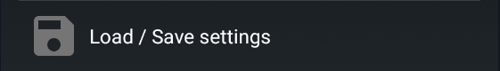
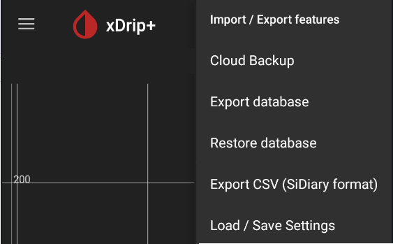

## Uninstall xDrip+

!!!warning "Historical data"  
    Uninstalling xDrip+ will also remove all data and settings without possible recovery.  
    Make sure you **[backup](#backup)** database and or all settings before.  
    It is recommended to upload data to [Nightscout](https://nightscout.github.io/).

 

This shouldn't usually be necessary but you might need to uninstall xDrip+ to troubleshoot, or if you need to change it to or from a private version. You can uninstall xDrip+ like any other Android app with a long press on the icon or from Android Settings -> Apps.

## Reinstall xDrip+

Follow this sequence:

1. Backup 
2. Uninstall xDrip+
3. Install xDrip+
4. Restore
5. Check all your settings and recreate your alarms

## Backup

### Backup settings

`Menu` / `Settings` / `Load / Save settings`

 

You also can access it from the 3 dots menu:

Select `Import Export features`.

Select `Load/Save settings`

 

Select `SAVE ALL SETTINGS`

Your settings will be saved in `/storage/emulated/0/Download/xDrip-Export` for old versions (export to SD) or in the `Download/xDrip-export` folder for recent versions   
You need to authorize xDrip+ to access your phone memory.  
Existing backup will be overwritten.

If you want to keep a safe copy, send the file to yourself by email, save in on a cloud drive or copy it via USB to a computer.

 

### Backup the database

The database contains all BG readings, treatments and notes. It is strongly recommended that you backup your database and keep a copy on another device if you want to keep your existing data and as a safety precaution against a phone loss, crash, ...  
Using upload to [Nightscout](https://nightscout.github.io/) is also strongly recommended.

From the main xDrip+ display select the upper right 3 dots menu.

Select `Import Export features`.

Select `Export database`.

 

The current database will be saved in `/storage/emulated/0/xDrip` or `Internal Storage/xDrip`
You need to authorize xDrip+ to access your phone memory.  
You can make as many backups as your memory can store.

If you're fast enough to touch the `SHARE` writing before it disappears you can use your phone share options to send the database to another device or copy it to another location.

Your backup will be named `exportYYYYMMDD-HHMMSS.zip` with `YYYY` current year, `MM` month, `DD` day, and `HHMMSS` for hour minutes and seconds. This will allow you to have multiple backups identified by a unique timestamp.

If you want to keep a safe copy, send the file to yourself by email, save in on a cloud drive or copy it via USB to a computer.

It is an SQLite database you can browse with various utilities like [SQLite Browser](https://sqlitebrowser.org/).

 

## Restore

### Restore settings

When xDrip+ install is complete, if a backup is available, xDrip+ will propose to restore it automatically.   
Select `RESTORE SETTINGS`

 

If you don't see this message, restore it manually.

`Menu` / `Settings` / `Load/Save settings`

 

You also can access it from the 3 dots menu:

Select `Import Export features`.

Select `Load/Save settings`

 

Select `LOAD ALL SETTINGS`

 

### Restore a database

!!!warning "Data loss"  
    Restoring a database will delete all current data.  
    Restore a database with **the same version of xDrip+ used to export it**.  
    Make sure to backup the current database before restoring a database. 

When xDrip+ install is complete, if a database backup is available, xDrip+ might propose to restore it automatically.

Make sure this is the database you want to restore then select `RESTORE`

*Note: the current database will be exported first, for safety, you will find it in the list named `b4import` and the date/time the import was done. This will allow you to recover it if necessary.*

 

If you want to restore a specific backup, from the main xDrip+ display select the upper right 3 dots menu.

Select `Import Export features`.

Select `Import database`.

Instructions are displayed. You don't need to move the backup file if you didn't move it from another device, you don't need to unzip it. Be cautious on restoring a database with a different xDrip+ version: it is recommended that you install the [xDrip+ version](../../install/install/#verify-which-version-is-installed) that was used to perform the export before importing, then you can update xDrip+.

Select the database you want to import, look at the date and size (use the phone file browser) to be sure to pick the right one.

Once sure you're trying to restore the correct backup, `Ok`

If you restored the wrong database, just redo the same steps and select the latest `b4import` version to roll back.

!!!info "Android 11 and above"  
    There is an issue with recent Android versions that will force you to restore the database sveral (3 to 4) times before you can see the full contents.

 

## New phone migration

Perform the following operations:

On the old phone:

1. [Backup settings and database](#backup)
2. Send yourself both settings and database backups, or copy them to a computer.

On the new phone:

1. [Install](../../install/download/#which-one-to-install) the [same version](../../install/install/#verify-which-version-is-installed) of xDrip+ you are using on the old phone.
2. [Backup settings and database](#backup) (this is only needed to create the correct folders).
3. Copy the files you sent yourself via mail, or from a computer to the right folders.
4. [Restore settings and database](#restore).  