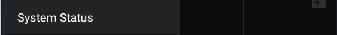

!!!xdrip ""  
    &ensp;System Status

System status provides internal information on xDrip+ collector state (either from a sensor or as a follower) as well as sharing, followers and smartwatch connected directly.

You can share a screenshot with the Android share button top right.

!!!xdripitem "System Status"

### Classic Status Page

This page shows information about the currently installed version.

!!!xdripitem "
  &emsp;Classic Status Page&emsp;
"  
    &emsp;Version: a2bbca9-2024.11.26

Version information allows you to quickly [find the matching release or pre-release](https://github.com/NightscoutFoundation/xDrip/releases). Before the version date you'll see the build version.

Any version name that shows additional information, like debug, dev, a smartwatch name, carelink, is a [forked version release](../../install/download/#forked-versions) of xDrip+ and might not contain all the latest functions of the released app (but probably some extra).

On this page you'll find the data source type (the one you selected to receive your BG values).

!!!xdripitem "Data Source:"

Next line shows the xDrip+ database size: the amount of memory it uses in your phone.

!!!xdripitem "Database size:"

In the case of a physical sensor, after the data source type, you'll see the name of the actual Bluetooth device connected to xDrip+. You can also see the connection status, keep in mind some sensors only connect for a short amount of time every 5 minutes and Not connected might not be an actual issue.

!!!xdripitem "Bluetooth Device:" 
!!!xdripitem "Connection Status:"
!!!xdripitem "Sensor Start:"

Since this page doesn't update automatically: you need to touch the rounded arrows to refresh it.

#### Restart collector - Forget device

!!!xdrip "&ensp;RESTART COLLECTOR&ensp;&emsp;&ensp;FORGET DEVICE&ensp;"

Restart collector will restart xDrip+ internal collector mechanism. The effect depends on the data source.

Forget device will only have effect when xDrip+ is connected through Bluetooth to a device.  
The device will be disconnected and you will need to scan Bluetooth from the main menu to recover the connection.

### Advanced status page

Most data sources will have an advanced status tab. Swipe your finger on the screen towards the left to display it.

##### Buggy Samsung

Renamed to Buggy Handset since other devices present this non-compliance.

##### Buggy Handset

This is not an error, but just the fact xDrip+ is [correcting](https://github.com/NightscoutFoundation/xDrip/issues/435) an Android non-compliance of some devices.  
It is recommended to [enable it](../../use/misc/#wake-workarounds) when experiencing data loss.

##### Slowest wake-up

It is an information on when xDrip+ received data against the expected time. Seconds are acceptable but minutes might be the sign of a connectivity issue.

#### G5,G6, 1 and 1+ 

See [here](https://navid200.github.io/xDrip/docs/Connectivity-troubleshoot.html).

#### Libre Bluetooth

If using a bridge, see the dedicated page [here](../librebridge).

If using a Libre 2 directly (ie without a bridge), see the dedicated page [here](../libre2direct).

#### xDrip+ Sync Follower

!!!warning "Work in progress"  
    In July 2024, Google shutdown the deprecated the [Firebase API](https://firebase.google.com/docs/cloud-messaging/migrate-v1) xDrip+ used for xDrip+ Sync.  
    Update xDrip+ to a version at least [July 23rd 2024](https://github.com/NightscoutFoundation/xDrip/releases/tag/2024.07.23).

xDrip+ follower is really simple to [setup](../../use/syncsetup). If you have issues with it, most of the time it's either a network connection or Google Play services issues.  
Having also [Nightscout](https://nightscout.github.io/) available as a backup follower solution is recommended when troubleshooting or following a child.

Followers will add-up in the list when identified, if you remove a follower it might take some time before it's actually removed from the list.

For initial setup problems check [here](../../install/xdripfollower/).

#### Nightscout Follower

Advanced status page will show the activity when downloading from Nightscout. If no data is available, make sure you have current BG values in Nightscout.

In case of download failure, if your Nightscout site is regularly updated by the master device and you see NS download errors this might be due to network problems. Disable Wi-Fi or SIM data and then try the other way round to exclude this problem.

If it's never been working make sure you have [setup](../../install/nightscoutfollower) your follower URL correctly.

Old Android versions might use expired certificates hence prevent Nightscout follower function. There is no workaround.

 

[*Last modified 8/12/2024*](https://github.com/NightscoutFoundation/xDrip/releases/tag/2024.11.26)