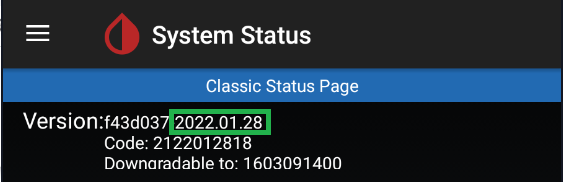

  
  

System status provides internal information on xDrip+ collector state (either from a sensor or as a follower) as well as sharing, followers and smartwatch connected directly.

### Classic Status Page

This page shows information about currently installed version, and previously installed version.  
For a new installation the downgradable version will show as 1603091400 by default.

Version information allows you to quickly [find the matching release or pre-release](https://github.com/NightscoutFoundation/xDrip/releases). Before the version date you'll see the build version.

Any version name that shows additional information, like debug, dev, a smartwatch name, carelink, is a [forked version release](../../install/download/#forked-versions) of xDrip+ and might not contain all the latest functions of the released app (but probably some extra).

On this page you'll find the data source type (the one you selected to receive your BG values) and the sensor start date (as entered as sensor start date and time, or automatically detected, depending on the sensor type).

In the case of a physical sensor, after the data source type, you'll see the name of the actual Bluetooth device connected to xDrip+. Keep in mind this page doesn't update automatically: you need to touch the rounded arrows to refresh it.

#### Restart collector - Forget device

Restart collector will restart xDrip+ internal collector mechanism. The effect depends on the data source.

Forget device will only have effect when xDrip+ is connected through Bluetooth to a device.  
The device will be disconnected and you will need to scan Bluetooth from the main menu to recover the connection.

### Advanced status page

Most data sources will have an advanced status tab. Swipe your finger on the screen towards the left to display it.

##### Buggy Samsung

This is not an error, but just the fact xDrip+ is [correcting](https://github.com/NightscoutFoundation/xDrip/issues/435) a non-compliance of Samsung devices.

##### Slowest wake-up

It is an information on when xDrip+ received data against the expected time. Seconds are acceptable but minutes might be the sign of a connectivity issue.

#### G5 and G6 

See the dedicated page [here](../connection).

#### Libre Bluetooth

See the dedicated page [here](../librebridge).

#### xDrip+ Sync Follower

xDrip+ follower is really simple to [setup](../../use/syncsetup). If you have issues with it, most of the time it's either a network connection or Google Play services issues.  
Having also [Nightscout](https://nightscout.github.io/) available as a backup follower solution is recommended when troubleshooting or following a child.

Followers will add-up in the list when identified, if you remove a follower it might take some time before it's actually removed from the list.

For initial setup problems check [here](../../install/xdripfollower/).

#### Nightscout Follower

Advanced status page will show the activity when downloading from Nightscout. If no data is available, make sure you have current BG values in Nightscout.

In case of download failure, if your Nightscout site is regularly updated by the master device and you see NS download errors this might be due to network problems. Disable Wi-Fi or SIM data and then try the other way round to exclude this problem.

If it's never been working make sure you have [setup](../../install/nightscoutfollower) your follower URL correctly.

 

[*Last modified 1/7/2022*](https://github.com/NightscoutFoundation/xDrip/releases/tag/2022.07.01)