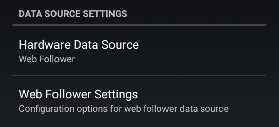
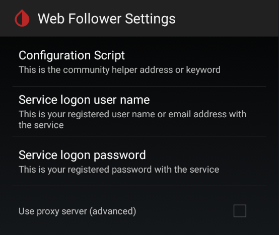

# Libre Web Follower

## System setup

When using this data source you need to make sure your system, is configured correctly with the vendor apps.

#### The [master](https://play.google.com/store/search?q=freestyle+libre+3&c=apps) app (connected to the Libre 3 sensor) should upload data in the vendor [server](https://www.libreview.com/).  

Log out and in to the server to verify you are using the right credentials.

Make sure you have data in the server.

#### The vendor [follower](https://play.google.com/store/search?q=librelinkup&c=apps) app should receive share data.  

Try to delete and resend an invitation to the vendor follower app (using the vendor master app).

Try to uninstall and reinstall the vendor follower app.

- Use preferably the set of credentials from the invitation to log in.
- If it doesn't work use the master app (server) credentials and resend the invitation.

 

## xDrip+ setup

Once the system is running on the vendor apps, you can troubleshoot xDrip+.

1. Make sure the data source is [Web follower](../../install/webfollower/).
2. Use the credentials from the follower you invited with the vendor master app.
3. If it doesn't work, you can try to use the server credentials to troubleshoot but be cautious to reduce the risks of an account lock.

 

## Vendor servers updates

Server updates might break the mechanism. Once xDrip+ has been fixed, you need to reset it following this sequence:

  
 

**Web follower settings**

Edit the `Configuration script`

Add a space after `beonlabs`, select `Ok`

Edit again the `Configuration script`, **remove the space** after `beonlabs`, and select `Ok`.

Wait up to a minute for data to display again.

 

[*Last modified 18/6/2023*](https://github.com/NightscoutFoundation/xDrip/releases/tag/2023.06.15)
