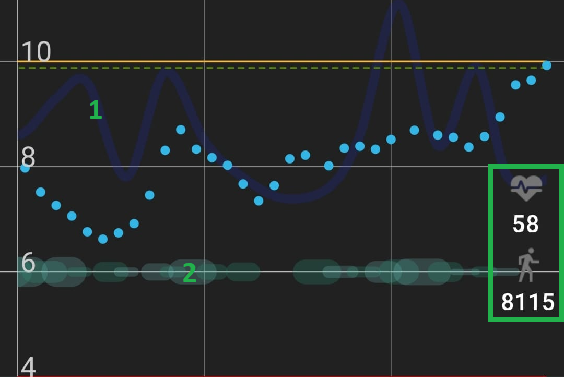

  
  

This menu allows you to customize many visual aspect settings of xDrip+.

*Note: Check [Graph settings](#graph-settings) features before using Color settings.*

### Color Settings

The example chart on top will show the effect of what you modify.

When modifying a color you can chose

1. hue and saturation
2. lightness/darkness
3. transparency.

The result will show compared to the original color.

You can revert the color to default or save it.

##### Glucose values and lines

You can customize the main BG plot. High and Low limits are defined in [Glucose Units settings.](../settings/#glucose-units)

High, In-range and Low Values color will change the graph and limit lines on your main view, notification and widget charts.

##### Colors of BG readings and Trend Arrows

You can also customize the current BG value and trend arrow color in respect with range limits.

Filtered values can be seen with sensors supporting raw data.

##### Treatments and predictions curves

1. Insulin on board ([treatment](../mainUI/#units-of-insulin) main curve)
2. Insulin activity (small dotted line)

1. Glucose [prediction](../predictions) (main prediction graph)
2. [Carbs](../mainUI/#grams-of-carbs) on board (small dotted line)

##### Average and target lines

1. 8-Hour average line
2. 24-Hour average line
3. Target line

##### Annotations and dots

[Blood tests (also calibrations), and treatments.](../mainUI/#treatments)

##### Backgrounds

Graphs backgrounds, main

##### [Notifications](../misc/#run-collector-in-foreground)

##### [Widget](../mainUI/#widget)

##### Plugins and features

If you use a [plugin](../../calibrate/advancedcal/#plugins) you can also display the plugin glucose value as a secondary graph.   
Plugin plot on graph must be enabled.

If you have steps and heart rate from a [wearable device](../../smartwatch/smartwatch/#smartwatch-sensors) you can customize graphs colors. 

In the example below 1. heart rate and 2. step counter.

##### Basal and SMB

If you manage to display basal ([from AAPS](#basal-information) or [manual setup](../predictions/#basal-profile-editor)) you can also customize the color.

[SMB](#smb)s are icons decluttering the graph for micro-bolus treatments.

##### Flair colors

If you want to put some color on the top and bottom bars of your Android screen, enable flair colors.

### Language

By default xDrip+ will use your phone language. You can select another language for xDrip+ and force it to display instead of the phone language. For this: select the language in Choose a specific language, then toggle the Force language Text switch.

### Smooth sensor noise

Smoothing displays the smoothed curve, useful for noisy measurements.  
You can also try [Graph smoothing](#graph-smoothing) to clean your graph.

### Show interface hints

After you first installed xDrip+ you will see hints during first opening of some features, you can disable this behavior or reset it.

### Graph Settings

You can customize most of the items that will display on the main graph.

##### Graph smoothing

Graph smoothing will apply a smoothing filter to the graph to make it easier to follow (less noise).  
This is only a visual effect and doesn't impact readings.

  

##### Rewrite history

Rewrite history will soften transitions after adding a new calibration to reduce the step like effect.  
Make sure this is also enabled on followers to avoid different visualization of past BG values. 

##### Widget range lines

You can select to visualize high and low limit lines on the widget.

##### Main graph lines

You can disable vertical time lines on the main graph.

You can disable horizontal glucose lines on the main graph.

##### Filtered data

Filtered or smoothed plot adds another graph curve and will eventually add missing data.

For some data sources (like patched LL app) this will expose the unfiltered raw data as xDrip+ BG display is already filtered.

##### Raw data

Raw data that can be displayed by xDrip+ if available.

G4, G5 and [old G6](../../troubleshoot/connection/#firefly-transmitters) provide raw data.

Now raw data are mainly visible for Libre sensors.

##### Basal information

If basal information is available from an external source ([AAPS NSClient](https://androidaps.readthedocs.io/en/latest/index.html)) it can be displayed by xDrip+.

In AAPS/NSClient config builder, xDrip+ Statusline, enable Show detailed IoB.

In xDrip+:  
Settings - Less common settings - enable Extra status line, enable [External status](../lesscommon/#extra-status-line).  
Settings - Inter-app - enable [Accept treatments](../interapp/#receiving-from-nsclient).  
Enable Show basal TBR.

Basal information will also be uploaded to [Tidepool](../cloud/#tidepool).

##### Target and average lines

You can visualize various reference lines on the graph:

1. 8-Hour average line
2. 24-Hour average line
3. Target line

##### Libre trend

[Libre trend](../3dotsmenu/#libre-trend) enables a small graph available in the three dots menu on the main view.

##### G6 predictions

G6 prediction is a built-in feature of the G6 transmitter showing as small grey dots.

##### SMB

SMBs are icons decluttering the graph for micro-bolus treatments. Touching the SMB gives the amount in insulin in the information line.

Display the Medtrum secondary sensor values.

##### Noise workings

Additional noise calculation information, yellow line.

##### Backfilled data

Backfilled data can be indicated with a different dot style.

##### Widget graph

You can hide the graph on the [widget](../mainUI/#widget) and keep only the value.

These two options are only available for developers.

##### Customize Y axis range

You can arbitrarily fix lower and upper value for the Y axis. Whenever readings will be out of this range, the graph will extend the range to make them visible. Y scale will then return to these settings when out of fixed range values are not displayed anymore.

### Glucose number from Filtered

Filtering might delay readings and is not recommended.  
Filtering of 20 minutes is hardware coded for [Patched Libre 2 app data source](../../install/libre2patch/).

### Bolus Wizard Preview

BWP will show insulin on board (IoB) and suggest corrections based on the [predictive](../predictions) parameters entered in xDrip+.  
This is an indication. Make sure you understand the EULA before using it.  
Never follow the suggestions when BG is fast changing.

If you force always show BWP it will always suggest a correction (insulin or carbs).

### High Priority Notifications

This will bring xDrip+ [graph and notifications](../misc/#run-collector-in-foreground) at the top of the list, disabling it brings it down.

### Public Notifications

This makes notifications visible on locked screen.

### Parakeet and Extra Test Features

You might have wanted to use these settings with a [Parakeet](https://github.com/jamorham/wixel-xDrip/blob/parakeet-gsm-modem/README.md).

### Enable Reminder Features

Enabled by default, you'll find reminders in the [three dots menu](../3dotsmenu) top right on the main view.

### Enable xDrip+ Accessibility

xDrip+ can interface with Android accessibility if your phone supports it.

### Numbered wall on Locked Screen

xDrip+ can display your BG value on the phone locked screen.  
Some features requires Android 7 and above.

This menu allows you to customize the number displayed.

1. You will see a real time preview of the result (123 ⇅)
2. Change the font size
3. Change the vertical position (or vertical distance between numbers)
4. Change the horizontal position (or horizontal distance between numbers)
5. Change the number color
6. Select the background image
7. The actual numbered wall

Locked screen display can be enabled on Android 7+.

You can change the text and background color.

Enable and disable the feature for a defined period of the day.

### Number Icon in Notification Area

xDrip+ can display your BG number as an icon in the top left notification area and in the drop down notifications.

You should test the feature before using it as it might crash on some phones.

You phone will vibrate a few times during the test and you should see the BG icon 123 top left.

If this doesn't work it means you shouldn't enable the feature.

**Once functionality is confirmed** you can enable it.

You can also enable a large icon, with or without arrow in the notifications area.

### Show xDrip on Boot

This will make xDrip+ open automatically when your phone restarts.

 

[*Last modified 3/15/2023*](https://github.com/NightscoutFoundation/xDrip/releases/tag/2023.15.03)