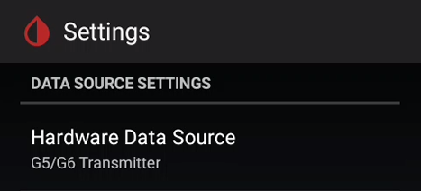

  
  
  

These settings are only available if you select a G5/G6 [hardware data source](/install/datasource#changing-data-source) and will not have any effect on other data sources.

##### OB1 Collector

The Observer 1 collector is a rewrite of the original xDrip collector code and **should be used** by default.

##### Native Algorithm

Using native Algorithm makes the transmitter itself handle calibrations like with the vendor app, xDrip+ only forwards calibration requests to the transmitter and doesn't use its own calibration algorithm.  
Native mode is automatically enabled if you select [G6 sensor](#g6-support) as only old (non-[Firefly](/troubleshoot/connection#firefly-transmitters)) transmitters will send raw data.

It is recommended to use Native calibration with G6/One as these sensors are factory calibrated and delivered with a specific calibration code used at sensor start.

If you use a re-batteried G5 or G6 transmitter you can opt for the xDrip+ algorithm (native algorithm disabled) and use the sensor for more than its standard lifetime without having to restart it.

##### Restart sensor

!!!warning "Don't use restart with recent G6/ONE"  
    Restart sensor will not work with [Firefly](/troubleshoot/connection#firefly-transmitters) transmitters for G6 and ONE.  
    You need to extract the transmitter for 20 minutes before you restart a sensor, do not use this option.

If you don't use native algorithm you don't need to restart your sensor.  
If you use native algorithm you can restart your sensor when or before it expires. Enable preemptive restarts to avoid the 2 hours warmup period.

[Preemptive restarts](#preemptive-restarts)

##### Go on without calibrations

If you use a G5 sensor or a G6 started as a G5 you can continue receiving BG without calibrating.  
This is not relevant for newer G6 and ONE.

##### Fallback to xDrip

If native algorithm stops sending data and you're using a G5 or an old G6 transmitter (non-Firefly), you can automatically switch to xDrip+ algorithm and use raw data. You then need to calibrate with xDrip+. **Not recommended**

##### Minimize Scanning

Disable this if your phone runs an Android version below 10.

##### Avoid Scanning

Disable this if your phone runs an Android version below 10.

##### G6 Support

This option enables specific features dedicated to G6/ONE sensors in xDrip+.  
Only select if you use a G6 or ONE sensor.

##### Allow OB1 unbonding

Leave this setting **disabled**: if you lose connection unbonding might force a new pairing request you might not see.

##### Allow OB1 initiate bonding

**Enable** this option.

##### Special pairing workaround

If you experience intermittent connection issues, enable this feature.  
It's been tested on Samsung phones with Android 11.

##### Manual slot number

This feature is available in engineering mode only for G6 transmitters.

##### Old G5 collector settings

!!!info  
    These settings are not used anymore if you enabled the OB1 collector.  
    Leave them as they are unless you use the original xDrip collector (**not recommended**).

##### Scan for G5 constantly

##### Force G5 to UI thread

##### Unbond G5 before each read

##### Battery Level Warning

You can setup a threshold for your transmitter battery level, for G6 Voltage B is the only parameter that represents it.  
You can then setup an alarm to inform you when the battery goes below this level.

 

##### Preemptive restarts

!!!warning "Don't use restart with G6/ONE"  
    Restart sensor will only work with G5 or re-batteried/modified G6 transmitters.  
    You need to extract the transmitter for 20 minutes before you restart a sensor, do not use preemptive restarts.

Restarting a sensor is not necessary if you don't use native algorithm.

You can restart your sensor before it will expire, that is at the end of day 6 or 9 for G5/G6.  
This will avoid you to wait for the 2 hours warmup period.

If you wish to be alerted when a preemptive restart occurs you can enable this alert.

Time travel will restart the sensor at day 3 to avoid jumps linked to the trauma insertion compensation algorithm. **Recommended**.

If your transmitter supports restart you can enable this feature. Most re-batteried transmitters firmware are supported, so are mod transmitters.

 

[*Last modified 11/12/2023*](https://github.com/NightscoutFoundation/xDrip/releases/tag/2023.12.11)