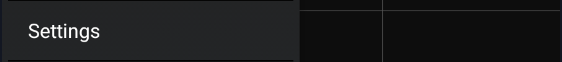

  
  

 

##### NFC meter

If you use a  Glucomen Aero meter with an NFC reader capable phone you can scan it to get last reading.

##### If you use a compatible Bluetooth meter

In order to enable Use Bluetooth Meter you need to pair a Bluetooth meter first.  
If this is a new meter **make sure you have measured BG at least once before trying to pair it**.

Put your meter in pairing mode and touch scan in the Scan for Bluetooth Meter menu.

Once paired you can enable the meter in the menu.  
It is not recommended to enable automatic calibration.

When you enable the use of the Bluetooth meter, all blood tests will automatically transfer into xDrip+ as [treatments](../mainUI/#treatments).

 

[*Last modified 4/5/2022*](https://github.com/NightscoutFoundation/xDrip/releases/tag/2022.05.04)