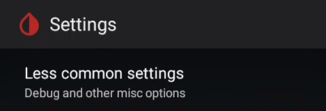

  
  

More xDrip+ settings are available in less common settings.  
If you can't find the setting you're looking for, keep in mind you can use the search lens from the main [settings](../settings) menu.

Obsolete. Drives to the old view of the [events log](../3dotsmenu/#events-log).

### Extra Status Line

Top left of your main graph you can see the standard status line.  
This menu allows you to add extra information in this area.

You need to enable the extra status line to add extra infomation.

You can make selected statistics to be calculated on the last 24 hours. By default they're starting at midnight.

There is a long list of available extra information you can display.  
Only select those you really need to see every 5 minutes.

You can also add this extra information on your [widget](../mainUI/#widget).

### [Advanced Calibration](../../calibrate/advancedcal)

### [Bluetooth Settings](../bluetooth)

### blueReader Settings

Settings for the [pioneer](https://www.startnext.com/en/bluereader/wall) Libre bridge device from Sandra.

### Advanced Settings for Libre 2

Show additional information for Libre 2 sensors

Display raw values on the [main graph](../display/#graph-settings)

Show more information in status

### Aggressive Service Restarts

Enabling this provokes a [collector restart](../../troubleshoot/systemstatus/#restart-collector-forget-device) when detecting missing data. This can be useful if you have connection problems.

### Interpret Raw Values

Display data when not available on the G4 receiver.

### Extra Logging Settings

These options are not used anymore.

Adding extra tags is useful for debugging as it will add specific traces in the log.

You need to know what you want to debug and set the correct level. Make sure to put valid tags to avoid xDrip+ crashing.

### Show Datatables

This feature is extremely useful if you calibrate using the xDrip+ algorithm (non native).

This will add new entries in your main menu:

*Note: Calibration graph will not show in native mode.*

### Display Bridge Battery

You can display your Bluetooth bridge battery level on the main view. This also applies to Libre bluetooth bridges.

### Disable Battery Warning

Disable battery warnings for G4 bridges

### Database automatic maintenance

Save Database Daily will actually export the database file every day before doing cleanup. This will use a large amount of your device memory and is not recommended.

Glucose retention will automatically delete data older than the number of days selected.  
Zero means don't delete anything (recommended). You can use 90 days if you use a cloud backup like Nightscout, so that you will still have all statistics available in xDrip+.

### [Other Miscellaneous Options](../misc)

### Sensor Location

Not used anymore.

