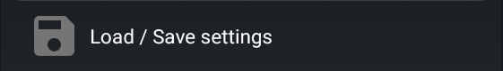

  
  

You also can access it from the 3 dots menu:  `Import Export features` `Load/Save settings`

  
  

You will find all options in this view.

### Save Settings

Your settings will be saved in `/storage/emulated/0/Download/xDrip-Export` for old versions (export to SD) or in the `Download/xDrip-export` folder for recent versions   
You need to authorize xDrip+ to access your phone memory.  

!!!warning "Existing backup file will be overwritten"

If you want to keep a safe copy, send yourself  the file by email, save in on a cloud drive or copy it via USB to a computer.

### Load Settings

!!!warning "Existing settings will be overwritten"

You might need to restart your phone to complete the operation.

### Delete Settings

Exported settings contain private information, once transfered to another phone or a safe location you might want to delete the backup.

 

[*Last modified 28/4/2022*](https://github.com/NightscoutFoundation/xDrip/releases/tag/2022.03.27)