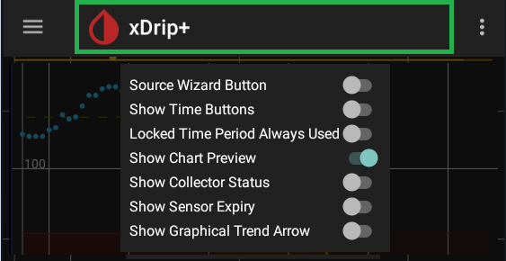
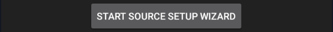
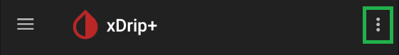
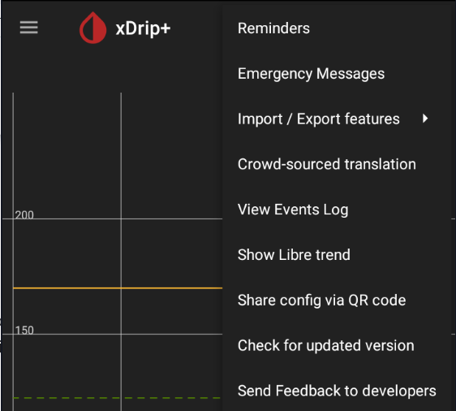

### Meet the user interface

Welcome to xDrip+!

If you've just setup xDrip+ you want to start with basic customizations:

1. [Setup the unit you want to display your blood glucose with](../settings)
2. [Add alarms](../alarms)
3. If you're connecting xDrip+ to a sensor, [share data to another phone with xDrip+](../../install/xdripfollower/) or to the [cloud](../cloud)
4. Display xDrip+ on the phone when [screen is locked](../display/#numbered-wall-on-locked-screen)
5. Add a [widget](#widget) to your phone home screen
6. Add a [smartwatch](../../smartwatch/smartwatch)

### Basic indications

You will see these default indications when xDrip+ receives data.

1. How long ago was the reading received and what's the BG difference with the previous value received.
2. What's the last measured BG value.
3. What's the trend in respect with the previous measurement.

!!!note "Trend arrow"  
    Note that the arrow gives the trend difference with the previous measurement, other CGM applications use an algorithm to give this indication and the result might not match.  
    In case of missing readings, the arrow might indicate fast rise or drop, always correlate with the indication in `1`.

You can customize the information shown in `1` with [Graph Settings](../display/#graph-settings).

You can [customize the trend arrow aspect](#blood-drop-menu) but not behavior.

### Treatments

You can log treatments with the syringe icon.

Add one or more elements to your treatment.

#### Blood test

It will display in the unit selected in xDrip+.

#### Grams of carbs

#### Units of insulin

!!!note  
    If you enabled [multiple insulin types](../predictions/#multiple-insulin-types), you should also select the insulin type for this treatment.

#### Time

And eventually the time of the treatment (if not now) expressed in 24 hours format, with or without a separator.

Treatments are valid when the green check mark appears in the upper right corner. Touch it to confirm the entries.

A summary is displayed. Touch the green `+` icon to confirm or red `x` icon to discard.

Once done, new symbols will appear on your graph.

Units and carbs show like this:

And blood tests like this (note the symbol is square unlike [calibrations](/calibrate/calibrate) that are round):

#### Edit and delete

When visible, you can delete treatments like this:

- Touch the treatment, look at the bottom of the screen: touch Add Note or Blood Test.

- You can enter a note or touch Delete to delete the entry. This applies to blood tests, carbs and insulin.

Note that if you touch a blood test and edit it you can also convert it to a calibration using Calibrate. This is possible if you didn't select `Never use them` in [Advanced Calibrations](../../calibrate/advancedcal).

You can use the microphone icon to verbally enter treatments or advanced commands.

A long touch on the microphone icon will allow you to write advanced commands.

### Treatment notes

Independently of treatments you can enter notes.

Enter the comment you want (like slow acting insulin units), or use the microphone icon to speak the note.

They will be added to the graph like this:

By touching them you can edit or delete them.

### Undo and Redo

1. Undo will step backwards through treatments simulations, calibrations and notes. After 30 minutes it will hide again.
2. Redo can step forwards through treatments simulations, calibrations and notes. After 30 minutes it will hide again.

### [Main menu](../hamburger)

Also called hamburger or drawer menu, this is the main menu in which you'll be able to find or add the most common actions you need and also all settings and customizations.

### Blood drop menu

With a long touch on the central area between main and three dots menu you can open another menu for customizing the user interface.

##### Source Wizard Button

Shows the button driving you through the data source selection as described [here](../../install/datasource).

##### Show Time Buttons

Adds a row of four presets for the main graph time range: 24, 12, 6 and 3 hours.  
If you long press a time button you can lock the view to that time period.

##### Locked time period always used

Sets the last modified display time period as default.

##### Show Chart Preview

Enables or disables the 24 hours small chart in the lower screen area.

##### Show Collector Status

Shows information messages regarding the collector status below the main graph.

##### Show Sensor Expiry

Displays the remaining time before sensor expiry below the main graph.

##### Show Graphical Trend Arrow

Adds an option allowing you to select other arrow styles.

Use the wrench and drop down menu to select them.  
Color arrows include a hue cursor to change color. 

Graphical trend arrows angle depends on the reading difference with the previous value (5 minutes) and not only flat/45/90 degree like the classic arrows.

### [Three dots menu](../3dotsmenu)

This menu contains some shortcuts to settings and other unique functions.

### Widget

If your phone supports widgets, long touch an empty area on your home screen and select widgets.  
Browse the apps until you find xDrip+. 

Keep your finger on the widget and drag it to the position you want it to be displayed.

You can resize it using the blue dots.

And make it the size you like. Then you can customize colors and contents aspect in [display settings](../display).

### Screensaver

If your phone supports this feature you can enable xDrip+ as screensaver in Android Settings.

When you put your phone in charge it will display a small graph and the BG value.

 

[*Last modified 15/5/2022*](https://github.com/NightscoutFoundation/xDrip/releases/tag/2022.05.12)
