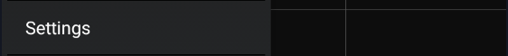

  
  

Motion tracking is used to detect vehicle mode and add functions when driving your car.  
Not all phones will support this feature.

You can track motion on your main graph.

As for xDrip+ sync you can define which phone will actually send the motion information: it will be the motion master, only one device can be master. You can setup a device to be follower to motion in order to monitor remotely the master device motion.

Vehicle mode enables more options.

You can enable automatically vehicle mode when connecting to your car Bluetooth audio system.  
You can also set it manually by identifying your car audio BLuetooth connection.

Raising the low level alarm will allow you to be informed at a higher level than setup in alarms.

You can make xDrip+ automatically enable spoken readings when driving.

You can have a sound played when switching to motion detection mode and a reminder sound every 90 minues. 

