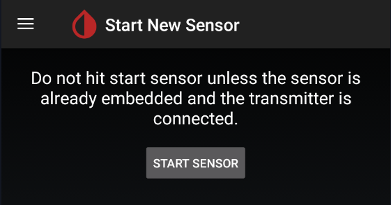
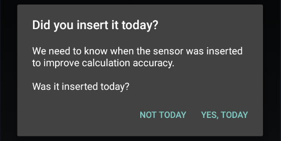
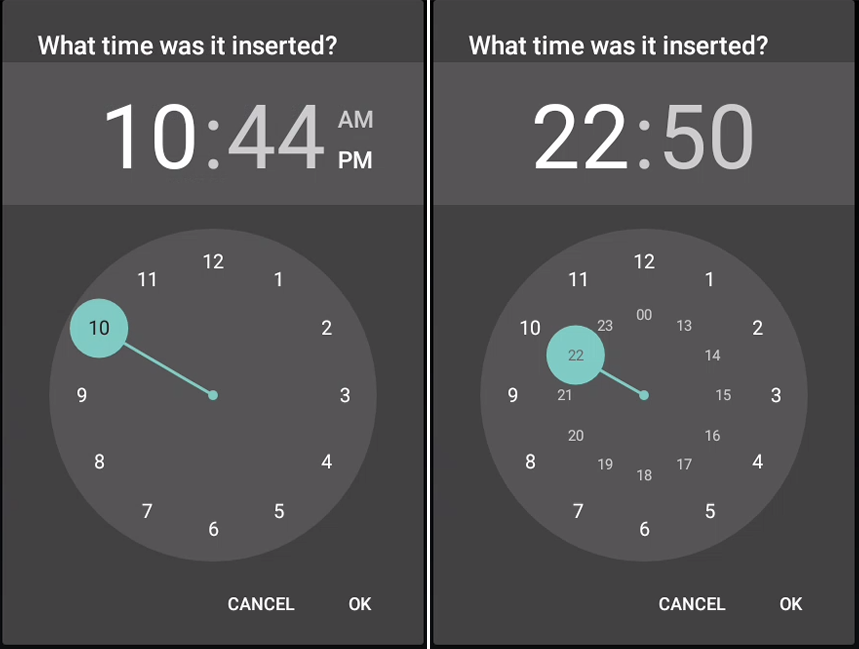
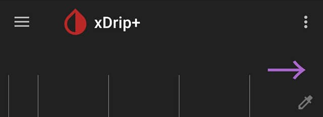
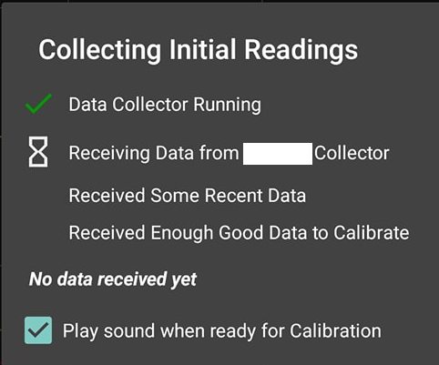
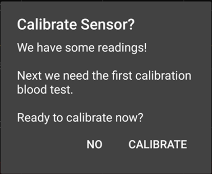

Starting a sensor in xDrip+ has very different functions depending on the sensor itself.

### G5, G6 and 1

Reference documentation is [here](https://navid200.github.io/xDrip/docs/Proper-connectivity.html).

### G7 and 1+

The sensor will start automatically at the time it is inserted. You don't need to start it in xDrip+.

 

### Libre

Note - this section does NOT apply to Libre 2/2+ (EU) connecting to xDrip+ without a bridge. For these, see the instructions for [Libre 2 Direct](../../install/libre2#starting-libre-2-sensors)

xDrip+ is not able to start a Libre sensor, neither is it to stop one (actually you can't stop this sensor: if it doesn't fail it will run it's useful lifetime and stop by itself after 14 days and 12 hours).

In order to start your sensor you need to use the vendor reader or app, some other third party apps like Glimp-S and eDropletNFC can start the Libre 1 sensor. Juggluco can start Libre 2 and 3 sensors.

xDrip+ sensor start is only used to track lifetime and make sure calibrations are updated. This operation is necessary and recommended each time you replace your sensor.

 

!!!xdripitem "Start sensor" 

Confirm `START SENSOR`

If you inserted the sensor today (i.e. not started or recently started), answer `YES, TODAY`

If you answered today select the hour you physically started the sensor dragging the blue pointer to the correct time. With 12 hours display, tap `am` or`pm`. With 24 hours display drop the correct hour either on the inner or outer ring for the correct hour. Tap `OK`.

Drag the minutes blue pointer to the correct time and tap `OK`.

The newly started sensor will continue its warm-up if started from less than one hour.

!!!warning  
    **Even if xDrip+ will attempt reading a sensor during its warm-up phase, values can range from unreliable to inconsistent and should not be used.**

If you're using [OOP1](../OOP/#oop1) or [OOP2](../OOP/#oop2) without calibration, BG will start displaying immediately without need of the initial calibration.

If you're using an already started sensor you will have a calibration request within 15 minutes.

If you see a purple arrow you might have made a mistake in the date and time the sensor was started as BG data is available but won't display during the 1 hour warm-up.

 

xDrip+ will now wait for readings and update the progress. Stay on this screen. Every reading is done 5 minutes apart so it should take less than 20 minutes.

If the data source shows LimiTTer and you're not using an actual [LimiTTer](https://github.com/JoernL/LimiTTer), your bridge device is not connected correctly.

The indication ***No data received yet*** will change to ***Need 3 recent readings***. If no data is received, [check your parameters](../../install/libreBT/#bridge-settings).

When enough readings are received, the calibration request will display. More about calibration [here](../../calibrate/101).

If your BG is within normal range (recommended in the lower normal range for a new sensor) and has been stable for the last 10 minutes, with no carbs not insulin active, you can calibrate.

If your BG is quickly varying or not within normal range, it is not recommended to calibrate now. 

Two readings are required from legacy G4 receiver, you can use only one if you're sure it's valid. Just put twice the same value. You can set one value as default [disabling double calibration](../../calibrate/advancedcal/#calibrations).

Your BG should start displaying on the main graph.

 

### Followers and companion apps

It it sometimes necessary to "start" a sensor session in xDrip+ to get readings.

Starting or stopping a sensor in xDrip+, when using a follower or companion source doesn't have any impact on the sensor.

!!!warning  
    The only exception is [xDrip+ Sync follower that might transmit the Start or Stop command to the actual sensor if it is directly connected to xDrip+ acting as master](../sync/#accept-followers-actions).  
    Do not use Start and Stop sensor with xDrip+ Sync follower unless you know the person with the master xDrip+ phone will know what to do with a stopped sensor!

!!!xdripitem "Start sensor" 

Confirm `START SENSOR`

Answer `NOT TODAY`

xDrip+ should pick-up readings with the next measurement.

 

[*Last modified 3/12/2024*](https://github.com/NightscoutFoundation/xDrip/releases/tag/2024.11.26)