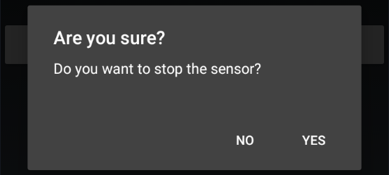

Stopping a sensor in xDrip+ has very different functions depending on the sensor itself.

### G5, G6 and 1

Reference documentation is [here](https://navid200.github.io/xDrip/docs/Proper-connectivity.html).

### G7 and 1+

These sensors stop by themselves after 10 days and 12 hours.

 

### Libre

xDrip+ is not able to stop a Libre sensor, actually you can't stop this sensor: if it doesn't fail it will run it's useful lifetime and stop by itself after 14 days and 12 hours.

xDrip+ sensor stop is only used to invalidate previous calibrations. This operation is necessary and recommended each time you replace your sensor.

 

!!!xdripitem "Stop Sensor"

Confirm `STOP SENSOR` unless you only want to [reset all calibrations](../../calibrate/calibrate/#reset-all-calibrations).

Confirm you want to stop the sensor.

If you change your mind and the sensor didn't expire yet, you can always ["restart"](../startsensor/#libre) it, il will resume the current session and eventually ask for a new calibration. xDrip+ doesn't physically restart Libre sensors.

 

### Followers and companion apps

There is no interest in stopping a sensor when using a follower app.

!!!warning  
    The only exception is [xDrip+ Sync follower that might transmit the Start or Stop command to the actual sensor if it is directly connected to xDrip+ acting as master](../sync/#accept-followers-actions).  
    Do not use Start and Stop sensor with xDrip+ Sync follower unless you know the person with the master xDrip+ phone will know what to do with a stopped sensor!

 

[*Last modified 3/12/2024*](https://github.com/NightscoutFoundation/xDrip/releases/tag/2024.11.26)