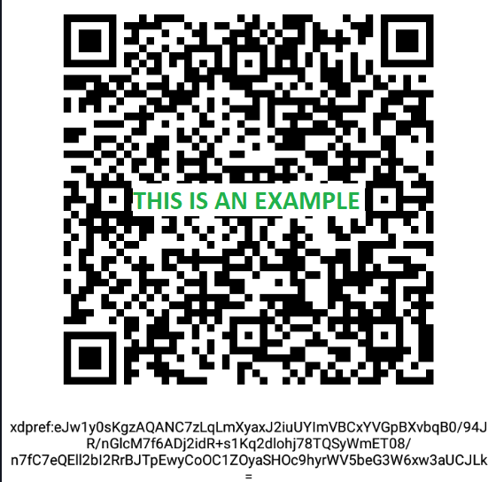
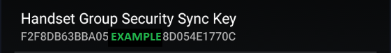
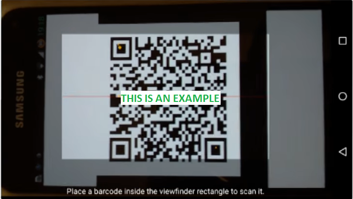
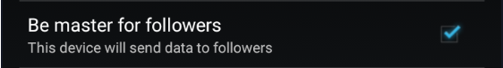

!!!xdrip ""  
    &ensp;Settings  
    &emsp;&ensp;xDrip+ Sync Settings

!!!warning "Old xDrip+ Sync"  
    In July 2024, Google shutdown the deprecated the [Firebase API](https://firebase.google.com/docs/cloud-messaging/migrate-v1) xDrip+ used for xDrip+ Sync.  
    Update xDrip+ to a version at least [July 23rd 2024](https://github.com/NightscoutFoundation/xDrip/releases/tag/2024.07.23) to use the legacy Sync method.  
    Updating xDrip+ to minimum latest release is recommended.

xDrip+ provides a unique real time sync mechanism between Android devices making BG and treatments sharing the easiest possible task.

 

[Here the original reference video](https://www.youtube.com/watch?v=LcgjfbYcWkE).

### Prerequisites

!!!warning  
    [Google Play services](https://play.google.com/store/apps/details?id=com.google.android.gms) are mandatory to use this feature. Make sure they are present, enabled and not subject to battery optimization.

xDrip+ master phone is the device that is actually getting directly glucose readings from a sensor, a bridge, an app.  
Having a follower device being xDrip+ sync master adds little value unless the follower device can't use the same data source.

Your master should receive data reliably. Always troubleshoot the master first if you don't have data on your follower.

## Setup master

Make the primary data source phone master (enable checkbox):

!!!xdrip ""  
    &ensp;Settings  
    &emsp;&ensp;xDrip+ Sync Settings  
    

    &emsp;&emsp;&emsp;&emsp;**Be Master for Followers &emsp;&emsp;**

 

### Copy the Sync Key

#### Option 1 (recommended)

On the master phone display the Sync Key QR code:

!!!xdrip ""  
    &ensp;&ensp;Show settings QR code  
    
  &emsp;XDRIP PLUS SECURITY KEY SETTINGS ONLY&emsp;

Leave the master phone on this picture for the moment.

##### Option 1 bis (follower phone cannot read the QR code)

Take a screenshot of the QR code and send it it the follower phone (MMS, WhatsApp, upload to Google Cloud, ...).

#### Option 2 (complicated)

!!!xdrip ""  
    &ensp;Settings  
    &emsp;&ensp;xDrip+ Sync Settings  
    
    &emsp;&emsp;&emsp;&emsp;**Handset Group Security Sync Key**

 

## Setup follower

Make all other phones followers (disable checkbox):

!!!xdrip ""  
    &ensp;Settings  
    &emsp;&ensp;xDrip+ Sync Settings  
    

    &emsp;&emsp;&emsp;&emsp;**Be Master for Followers &emsp;&emsp;**

 

!!!warning "Use xDrip Cloud must be set identically on all phones"  
    Master and followers. Either it is ON for all, or OFF for all.

!!!xdripitem "Use xDrip Cloud"  
    &ensp;Use the new xDrip+ cloud servers. Master and follower must have this setting set the same.  

### Copy the Sync Key from the master

#### Option 1 (recommended)

!!!xdrip ""  
    &ensp;Settings  
    &ensp;&ensp;Auto Configure  
    &emsp;&emsp;&emsp;Camera

You need to authorize xDrip+ to access the phone camera.  
Scan the QR code displayed on your master phone.

You will be asked to confirm you want to import these settings (make sure you import safe settings).

!!!xdripitem "Are you sure?"  
    &ensp;Only import settings from sources you trust!  
    &ensp;Please confirm to import the following settings:  
      
    &ensp;setting1  
    &ensp;setting2  
    &ensp;setting3  
      
    No&emsp;&emsp;&ensp;Yes&ensp;     

#### Option 1 bis (follower phone cannot read the QR code)

!!!xdrip ""  
    &ensp;Settings  
    &ensp;&ensp;Auto Configure  
    &emsp;&emsp;&emsp;Image file

Select the image containing the QR code.

!!!xdripitem "Are you sure?"  
    &ensp;Only import settings from sources you trust!  
    &ensp;Please confirm to import the following settings:   
    
    &ensp;setting1  
    &ensp;setting2  
    &ensp;setting3  
    
    No&emsp;&emsp;&ensp;Yes&ensp;  

#### Option 2 (complicated)

Edit the key field and type **exactly** the same key than the master.

!!!xdrip ""  
    &ensp;Settings  
    &emsp;&ensp;xDrip+ Sync Settings  
    
    &emsp;&emsp;&emsp;&emsp;**Handset Group Security Sync Key**

 

[*Last modified 15/12/2024*](https://github.com/NightscoutFoundation/xDrip/releases/tag/2024.11.26)