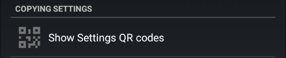
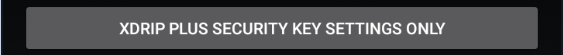
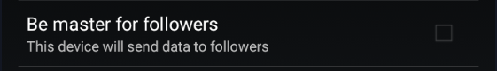

  
  

 

!!!warning "Work in progress"  
    In July 2024, Google shutdown the deprecated the [Firebase API](https://firebase.google.com/docs/cloud-messaging/migrate-v1) xDrip+ used for xDrip+ Sync.  
    Update xDrip+ to a version at least [July 23rd 2024](https://github.com/NightscoutFoundation/xDrip/releases/tag/2024.07.23) to use the legacy Sync method.  
    Updating xDrip+ to minimum latest release is recommended.

xDrip+ provides a unique real time sync mechanism between Android devices making BG and treatments sharing the easiest possible task.

 

[**Here the reference video**](https://www.youtube.com/watch?v=LcgjfbYcWkE).

### Prerequisites

!!!warning  
    [Google Play services](https://play.google.com/store/apps/details?id=com.google.android.gms) are mandatory to use this feature. Make sure they are present, enabled and not subject to battery optimization.

xDrip+ master phone is the device that is actually getting directly glucose readings from a sensor, a bridge, an app.  
Having a follower device being xDrip+ sync master adds little value unless the follower device can't use the same data source.

Your master should receive data reliably. Always troubleshoot the master first if you don't have data on your follower.

## Setup master

Make the primary data source phone master (enable checkbox):

  
  
  

Enable Use xDrip Cloud.

!!!xdripitem "Use xDrip Cloud&emsp;&emsp;&emsp;&emsp;&emsp;&emsp;&emsp;&emsp;&emsp;&emsp; →`ON`"  
    &ensp;Use the new xDrip+ cloud servers. Master and follower must have this setting set the same.  

 

### Copy the Sync Key

#### Option 1 (recommended)

On the master phone display the Sync Key QR code:

  
  

  

Leave the master phone on this picture for the moment.

#### Option 2 (complicated)

Write down the master key.

  
  
   

 

## Setup follower

After Google shutdown the deprecated the [Firebase API](https://firebase.google.com/docs/cloud-messaging/migrate-v1) used for xDrip+ Sync in July 2024, a new sharing method has been developed. If you experience issues, enable this feature.

!!!xdripitem "Use xDrip Cloud&emsp;&emsp;&emsp;&emsp;&emsp;&emsp;&emsp;&emsp;&emsp;&emsp; →`ON`"  
    &ensp;Use the new xDrip+ cloud servers. Master and follower must have this setting set the same.  

### Copy the Sync Key from the master

#### Option 1 (recommended)

  

You need to authorize xDrip+ to access the phone camera.  
Scan the QR code displayed on your master phone.

#### Option 2 (complicated)

Edit the key field and type **exactly** the same key than the master.

 

### Disable master mode

Make sure the follower phone is not master (disable checkbox).

Set the follower to xDrip+ Sync follower data source.

  
  
  
 

You might need to reboot the follower phone to validate everything and get data.

 

[*Last modified 28/9/2024*](https://github.com/NightscoutFoundation/xDrip/releases/tag/2024.09.27)